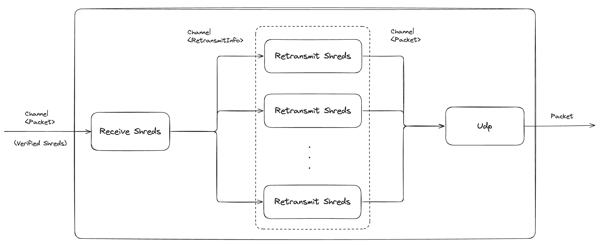

# Networking 

## Running Demos with Dashboards

- For starting up prometheus and grafana, checkout our guide [here](https://docs.syndica.io/sig/usage/metrics).
- The relevant dashboards are **Transaction Sender Metrics** and **Turbine Metrics** which should be visible in Grafana after following the above

### Gulf Stream: Mock Transfers

An example of how to run the transaction sender with generated transfer transactions can be seen in the script below. Currently the mock transfer generator waits for each transaction to be rooted before sending another, this can be changed by calling `sigTransfer` instead of `sigTransferAndWait` [here](https://github.com/Syndica/sig/blob/1cc85773a70a0536ac5b4afd3899aff8c603c460/src/transaction_sender/mock_transfer_generator.zig#L116). Keep in mind that the test will exit once the mock transfer generator has exited, so if using `sigTransfer` a wait should be used after sending transfers or the folling [line](https://github.com/Syndica/sig/blob/1cc85773a70a0536ac5b4afd3899aff8c603c460/src/transaction_sender/mock_transfer_generator.zig#L129) removed.

Since we do not have consenus we rely on some Rpc calls for signature validation, hence, the performance of the transaction sender is currently limited. 

- script: ./demo/run_gulfstream_with_mock_transfer_generator.sh
- dashboard: ./demo/misc/dashboard_gulfstream_demo.json
- entrypoint: https://github.com/Syndica/sig/blob/1cc85773a70a0536ac5b4afd3899aff8c603c460/src/cmd/cmd.zig#L1187
 
### Turbine: Stake Override

An example of how the run the turbine retransmit stage with stake overriding can be seen in the script below. This first removes state from the previous run if present and then runs the sig validator with a few minor tweaks to spin up only the components required (i.e. skip account indexing). 

- script: ./demo/run_turbine_retransmit_with_stake_override.sh \<exit-after-n-shreds\>
- dashboard: ./demo/dashboard_turbine_demo.json
- entrypoint: https://github.com/Syndica/sig/blob/1cc85773a70a0536ac5b4afd3899aff8c603c460/src/cmd/cmd.zig#L733

### Turbine: Black Box

An example of how to run the turbine tree black box can be seen in the script below. This runs both the sig and agave tests, printing results to a file each for validation, permalinks are provided below:

- script: ./demo/run_turbine_tree_black_box_tests.sh
- sig: https://github.com/Syndica/sig/blob/harnew/demo/src/turbine/turbine_tree.zig#L873
- agave: https://github.com/Syndica/agave/blob/cd3b807e452430bcf327df392f3d5eea1bb1cf8f/turbine/src/cluster_nodes.rs#L883

Note: you will need to build the agave black box binary as follows
- checkout https://github.com/Syndica/agave/tree/harnew/networking-demo 
- cd turbine
- cargo build --release

## Milestones
**Turbine**: Validator is able to forward shreds to other validators according to stake weight and other factors

**Gulfstream**: Validator is able to forward transactions to other validators TPU port for processing (according to leader 
schedule)

 

 

## Gulfstream - sig/src/transaction_sender

At a high level the sig transaction send service:
- read transactions from channel
- send transactions to upcoming leaders via quic
- adds transactions to a transaction pool for monitoring and retries
- retry transactions until they are rooted, failed, expired, or exceeded max retries

 

**Note**: since sig does not support consensus, the transaction send service makes the following RPC calls; getSignatureStatuses, getBlockHeight, and getSlot

### Demonstration - Landing Transfer Transactions

- **Sending Mock Transactions**:
    - Setup two accounts, a 'bank' and 'alice'
    - Ensure 'bank' has enough lamports to conver total transfer amount + transfer fees
    - Ensure 'alice' has zero lamports
    - Send 5_000_000 lamports to 'alice' over five transactions of 1_000_000 lamports each
    - Confirm that 'alice' has received 5_000_000 lamports
    - permalink: https://github.com/Syndica/sig/blob/81f2779de1a5b7127154579bd28770abbb9b030c/src/transaction_sender/mock_transfer_generator.zig#L55

- **Gulfstream - Transaction Sender**
    - the sig transaction sender is run normally
    - permalink: https://github.com/Syndica/sig/blob/81f2779de1a5b7127154579bd28770abbb9b030c/src/transaction_sender/service.zig#L39
 

## Turbine - sig/src/turbine

At a high level the sig turbine retransmit stage:
- reads verified shreds from a channel populated by the shred collector
- runs deduplication of shreds for both the raw bytes and shred ids
- groups shreds by slot to streamline retrieval of turbine trees and slot leaders
- packages each shred into a RetransmitInfo struct containing the data required to compute turbine children
- sends each RetransmitInfo struct along a channel to one of N retransmit threads
- retransmit threads compute the turbine children and their addresses, sending new packets along a channel for transmission to the network

 

### Demonstration - Retransmitting Shreds as a *Staked Validator 

- **Issue**: unstaked validators are *always leaf nodes on testnet
    - a live demo won't show shred retransmission without stake 
    - real stake would cause negative network effects as sig is incomplete

- **Solution**: manually override our validators stake when building the turbine tree 
    - a live demo will show shred retransmission at both level 0 (root) and level 1 of the turbine tree
    - we will retransmit to the wrong nodes, however, this will have insignificant network effects
    - permalink: https://github.com/Syndica/sig/blob/81f2779de1a5b7127154579bd28770abbb9b030c/src/turbine/turbine_tree.zig#L359
    
### Demonstration - Retransmitting to the Correct Validators

- **Turbine Tree Determinism**: 
    - the epoch staked nodes always make up the first `n` nodes of a turbine tree; hence
    - the first `n` nodes of a turbine tree are **deterministic** amongst validators with respect to:
        - epoch staked nodes
        - shred id
        - slot leader
    - after the `nth` node, the turbine tree is **non-deterministic** as it depends on each validators internal gossip table
    - permalinks:
        - sig (seeding): https://github.com/Syndica/sig/blob/81f2779de1a5b7127154579bd28770abbb9b030c/src/turbine/turbine_tree.zig#L250
        - agave (seeding): https://github.com/Syndica/agave/blob/cd3b807e452430bcf327df392f3d5eea1bb1cf8f/turbine/src/cluster_nodes.rs#L209
        - sig (building): https://github.com/Syndica/sig/blob/81f2779de1a5b7127154579bd28770abbb9b030c/src/turbine/turbine_tree.zig#L139
        - agave (building): https://github.com/Syndica/agave/blob/cd3b807e452430bcf327df392f3d5eea1bb1cf8f/turbine/src/cluster_nodes.rs#L280

- **Black Box Approach**
    - create a test cluster in both sig and agave, consisting of:
        - a random set of staked nodes,
        - a gossip table containing the staked nodes plus other random unstaked nodes
    - create a TurbineTree (sig) / ClusterNodes\<Retransmit\> (agave) using the test cluster 
    - sample N random shred ids and compute the retransmit children 
    - confirm that the gerenated cluster info, and computed retransmit children are identical
    - permalinks
        - sig: https://github.com/Syndica/sig/blob/81f2779de1a5b7127154579bd28770abbb9b030c/src/turbine/turbine_tree.zig#L873
        - agave: https://github.com/Syndica/agave/blob/cd3b807e452430bcf327df392f3d5eea1bb1cf8f/turbine/src/cluster_nodes.rs#L883