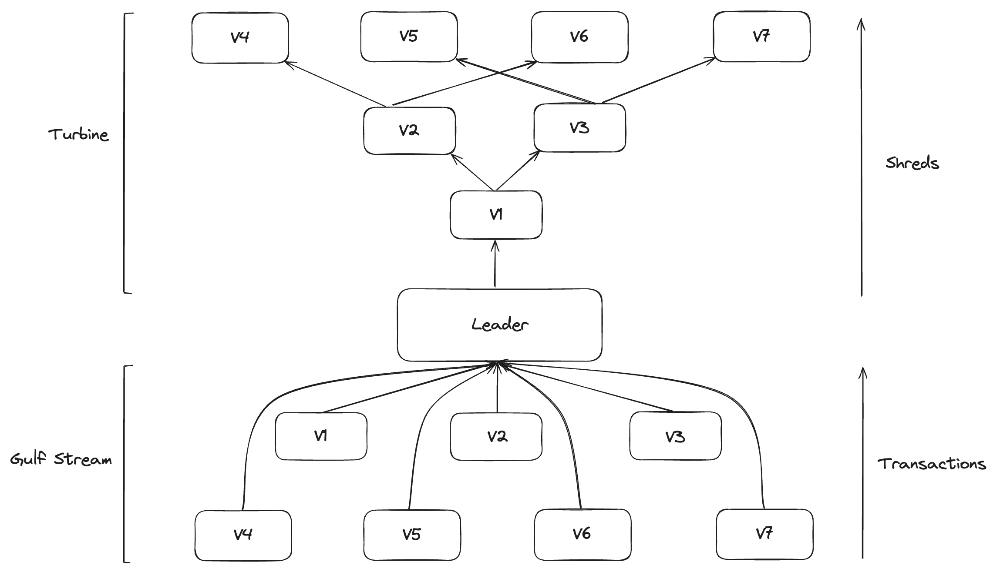

# Networking 

## Milestones
**Turbine**: Validator is able to forward shreds to other validators according to stake weight and other factors

**Gulfstream**: Validator is able to forward transactions to other validators TPU port for processing (according to leader 
schedule)

 

 

## Gulfstream - sig/src/transaction_sender

Sig transaction send service:
- read transactions from channel
- send transactions to upcoming leaders via quic
- add transactions to a transaction pool for monitoring and retries
- retry transactions until they are rooted, failed, expired, or exceeded max retries

 

**Note**: since sig does not support consensus, the transaction send service makes the following RPC calls; getSignatureStatuses, getBlockHeight, and getSlot

### Demonstration - Landing Transfer Transactions

- Setup two accounts, a 'bank' and 'alice'
- Ensure 'bank' has enough lamports to conver total transfer amount + transfer fees
- Ensure 'alice' has zero lamports
- Send 5_000_000 lamports to 'alice' over five transactions of 1_000_000 lamports each
- Confirm that 'alice' has received 5_000_000 lamports

 

## Turbine - sig/src/turbine

Sig retransmit stage of turbine block propagation:
- TODO

### Stake Overwrite Tests

- testing with no stake we will never have children to retransmit to :(
- manually overwriting **our** stake when build the turbine tree works to demonstrate retransmition of shreds 
    - even though we are retransmitting to the wrong nodes this will have insignificant network effects

### Equivalence Tests

- the above demonstrates that we can retransmit shreds to nodes, but how do we know that they are the **right** nodes
- we can check that we produce the same children as agave if given the same staked nodes and gossip table state
    - sig: https://github.com/Syndica/sig/blob/fc846a33faef9345fb363c4d5e0090484ff52a17/src/turbine/turbine_tree.zig#L873
    - agave: https://github.com/Syndica/agave/blob/9cf843b2982fc03259f52fcd7cfa5c1c4d21fe0c/turbine/src/cluster_nodes.rs#L884

## TODO: 
- create turbine diagrams
- fill in turbine implementation details
- clean up turbine logs
- more load on transaction sender 
- additional equivalence test case