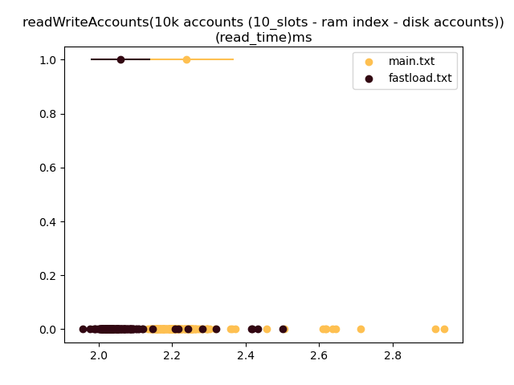

# benchmarks 

- run all benchmarks: `./zig-out/bin/benchmark` 
- filter specific cases: `./zig-out/bin/benchmark accounts_db_readwrite`
- different output types (examples below)
    - default includes: min, max, mean, variance 
    - `-r` prints all the run times
        - by using this option, you can also visualize the output against multiple runs (see below)

### example output

#### default
```
benchmark, read_time_min, read_time_max, read_time_mean, read_time_variance, benchmark, write_time_min, write_time_max, write_time_mean, write_time_variance, 
readWriteAccounts(100k accounts (1_slot - ram index - ram accounts)), 172156041, 158767959, 162868245, 15183799545214, 303852750, 286908417, 292925858, 39820330697776, 
readWriteAccounts(100k accounts (1_slot - disk index - ram accounts)), 165480250, 156170500, 160821658, 7611019088428, 319935833, 286708833, 304248199, 113169780175088,
```

#### with `-r`
```
readWriteAccounts(100k accounts (1_slot - ram index - ram accounts)) (read_time), 41451000, 40685750, 41123125, 40722417, 40743667
readWriteAccounts(100k accounts (1_slot - ram index - ram accounts)) (write_time), 81834042, 75340000, 76776125, 74969958, 74682792
```

#### visualizing

```bash
./zig-out/bin/benchmark accounts_db_readwrite -r 2>&1 | tee bench_results.txt # save output to file
# NOTE: need to format doc to below
python scripts/view_bench.py bench_results.txt # view runtimes as a charts with one file source
python scripts/view_bench.py bench_results.txt b_results2.txt # compare runtimes against two *equivalent* files
```

- format
```bash
# each file should be something like:
# {benchmark_name}, {runtime1}, {runtime2}, ...
#
# eg,
# % cat b_results.txt
# benchmark1, 1, 2, 3, 4, 5
# benchmark2, 1, 2, 3, 4, 5
```


- each point on y-axis=0 is a runtime
- the point on y-axis=1 is the mean with the bar surrounding it being the standard deviation