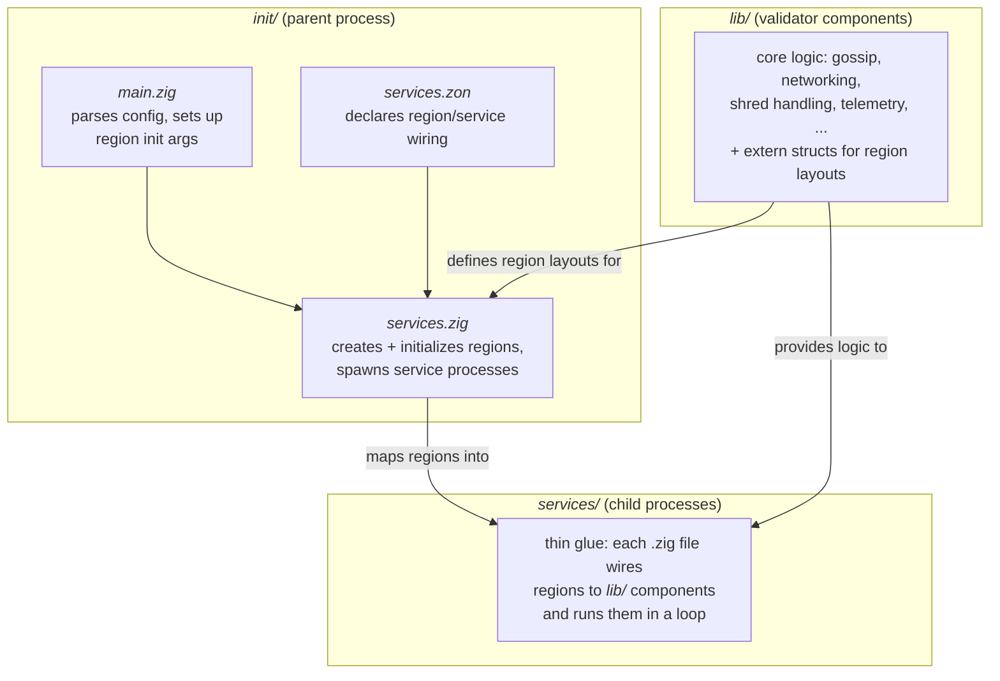

# Running Shred Receive

1. Advertise yourself on gossip. This can be done with starting up v1 gossip, with a patch to 
advertise a turbine receive port.

```diff
--- a/src/cmd.zig
+++ b/src/cmd.zig
@@ -1058,13 +1058,16 @@ fn gossip(
         app_base.shutdown();
         app_base.deinit();
     }
 
     const gossip_service = try startGossip(
         allocator,
         gossip_value_allocator,
         cfg,
         &app_base,
-        &.{},
+        &.{.{ .tag = .turbine_recv, .port = 8002 }},
         .{},
     );
     defer {
```

`sig gossip -c testnet`

2. Use Agave to create a leader schedule text file, e.g.

`solana leader-schedule > schedule.txt`

3. Start up v2

`zig build run -- config/testnet.zig.zon `

# Running with tracy

1. Build with `-Denable-tracy`

2. Use `.sandboxing_mode = .threaded` in your config

# Linting

Run V2 lint checks from this directory:

```sh
zig build lint
```

Pass explicit linter args after `--`:

```sh
zig build lint -- --fix
```

Run lint unit tests:

```sh
zig build lint-test
```

# Adding a New Service

v2 runs each service as an isolated process. Services cannot allocate memory or open files at runtime. 
Instead, they communicate through shared memory: fixed-size buffers created by the parent process before any
service is spawned. Each service declares which regions it needs and whether it needs read-only or read-write access.

This walkthrough adds a service called `foo` that reads a config region
and logs through telemetry.



Start by defining the data layout that will live in shared memory. The struct must be `extern` to guarantee a stable memory layout across process
boundaries (Zig's default struct layout is not guaranteed to be consistent across compilations). Since regions are mapped at different virtual addresses
in each process, pointer values from one process are invalid in another. Use fixed-size buffers with length fields instead of pointers or slices.

```zig
// lib/foo.zig
const std = @import("std");

pub const Config = extern struct {
    bar_buf: [64]u8,
    bar_len: u8,
};
```

Register it in `lib/lib.zig` alongside the other modules:

```diff
--- a/lib/lib.zig
+++ b/lib/lib.zig
 pub const telemetry = @import("telemetry.zig");
+pub const foo = @import("foo.zig");

 comptime {
     // ...
     _ = telemetry;
+    _ = foo;
 }
```

Now write the service. Every service file exports a `name` that matches its entry in `services.zon`, 
`ReadOnly`/`ReadWrite` structs whose fields map to its regions (in declaration order), 
and a `serviceMain` entry point. The `start` import provides the panic handler and log options that the runtime expects.

```zig
// services/foo.zig
const std = @import("std");
const start = @import("start");
const lib = @import("lib");
const tel = lib.telemetry;

comptime {
    _ = start;
}

pub const name = .foo;
pub const panic = start.panic;
pub const std_options = start.options;

pub const ReadOnly = struct {
    config: *const lib.foo.Config,
};

pub const ReadWrite = struct {
    tel: *tel.Region,
};

pub fn serviceMain(ro: ReadOnly, rw: ReadWrite) !noreturn {
    const logger = rw.tel.acquireLogger(@tagName(name), "main");
    rw.tel.signalReady();

    const bar = ro.config.bar_buf[0..ro.config.bar_len];
    logger.info().logf("foo service started with bar: {s}", .{bar});

    while (true) {}
}
```

With the service written, declare its wiring in `services.zon`. The `regions` block maps names to region types. The `services` block lists each
service and the regions it can access. Access is either `.readonly` (the region is mapped without write permission) or `.rw`.

```diff
--- a/init/services.zon
+++ b/init/services.zon
     .regions = .{
         // ...
         .telemetry = .telemetry,
+        .foo_config = .foo_config,
     },
     .services = .{
         // ...
+        .{
+            .name = .foo,
+            .regions = .{
+                .{ .name = .foo_config, .access = .readonly },
+                .{ .name = .telemetry, .access = .rw },
+            },
+        },
     },
```

The parent process needs to how to initialize the region before spawning
services. In `init/services.zig`, add a variant to the `Region` union. The
variant's payload holds the init-time parameters (these can use slices, since
they only exist in the parent). The `size` function returns the byte size of
the extern struct, and `init` copies the config into the shared buffer.

```diff
--- a/init/services.zig
+++ b/init/services.zig
 pub const Region = union(enum) {
     // ...
     telemetry: tel.Region.Info,
+
+    foo_config: struct {
+        bar: []const u8,
+    },

     pub fn size(self: Region) usize {
         return switch (self) {
             // ...
             .telemetry => |cfg| cfg.regionSize(),
+            .foo_config => @sizeOf(lib.foo.Config),
         };
     }

     pub fn init(self: Region, buf: []align(page_size_min) u8) !void {
         return switch (self) {
             // ...
+            .foo_config => |cfg| {
+                std.debug.assert(buf.len == @sizeOf(lib.foo.Config));
+                const data: *lib.foo.Config = @ptrCast(buf);
+
+                @memcpy(data.bar_buf[0..cfg.bar.len], cfg.bar);
+                data.bar_len = @intCast(cfg.bar.len);
+            },
         };
     }
 };
```

Finally, parse the config value in `init/main.zig` and feed it into the
shared regions. Add a field to `Config`, append the service to the instance
list, and pass the region init parameters to `toSharedRegions`.

```diff
--- a/init/main.zig
+++ b/init/main.zig
 const Config = struct {
     // ...
     telemetry: Telemetry,
+    foo: Foo,

+    const Foo = struct {
+        bar: []const u8,
+    };
 };

 const service_instances: []const services.ServiceInstance = &.{
     // ...
     .{ .service = .telemetry },
+    .{ .service = .foo },
 };

 const shared_regions = services.toSharedRegions(.{
     // ...
+    .foo_config = .{
+        .bar = config.foo.bar,
+    },
 });
```

And add the corresponding entry to your config file:

```diff
--- a/config/testnet.zig.zon
+++ b/config/testnet.zig.zon
     .telemetry = .{
         .port = 12345,
     },
+    .foo = .{
+        .bar = "my_foo",
+    },
 }
```
