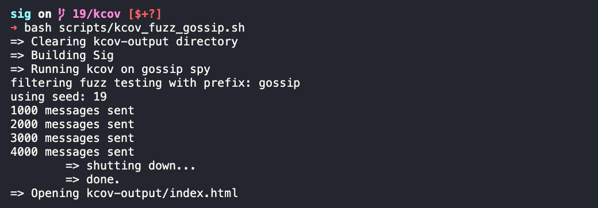
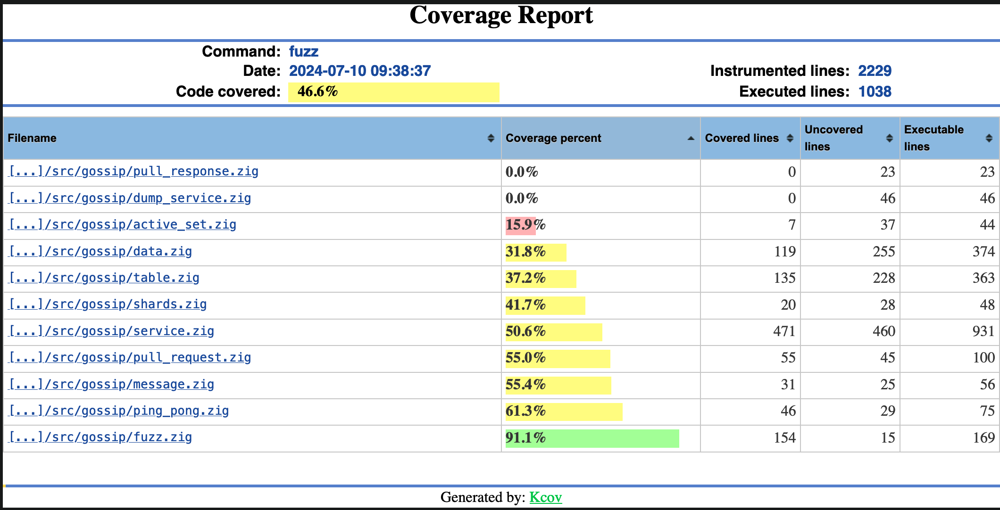
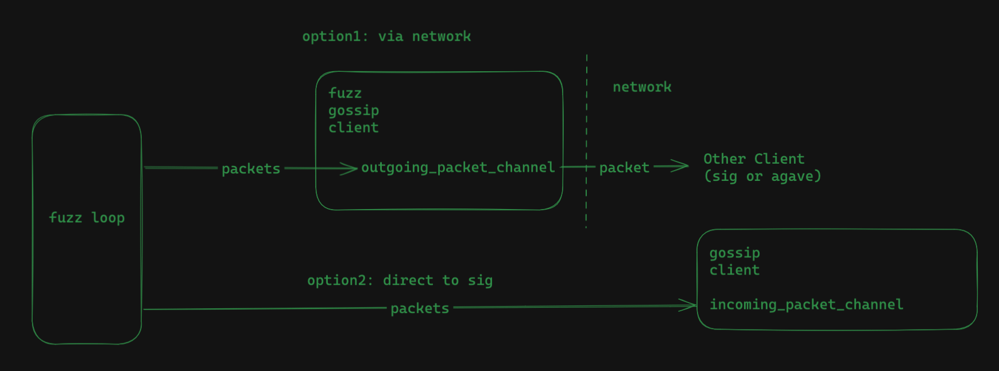

# fuzzing documentation

supported components: 
- gossip 
- accountsdb 

main code paths:
- `fuzz.zig` <- main entrypoint
- `gossip/fuzz_table.zig`
- `gossip/fuzz_service.zig`
- `accountsdb/fuzz.zig`
- `scripts/` <- kcov + fuzz bash scripts

kcov will give you coverage information on what was and was not fuzzed
- [https://github.com/SimonKagstrom/kcov](https://github.com/SimonKagstrom/kcov)

*note:* view the full script for helpful install instructions





## gossip 

### service

gossip supports two types of fuzzing 
- *option1*: sending fuzz packets to an arbitrary endpoint
- *option2*: sending fuzz packets directly to a sig client



example commands: 
```bash
#                                 <seed>  <n_messages>  <to_endpoint>    (option1)
./zig-out/bin/fuzz gossip_service 10      4_000         127.0.0.1:8001

#                                 <seed>  <n_messages> (option2)
./zig-out/bin/fuzz gossip_service 10      4_000

#                                 (run with random seed for inf)
./zig-out/bin/fuzz gossip_service 
```

### table

you can also fuzz the `GossipTable` (see `src/gossip/table.zig`) for reads/writes/trims/remove-old-labels using the following:

example commands: 
```bash
#                               <seed>  <n_messages>
./zig-out/bin/fuzz gossip_table 10      4_000

#                               (run with random seed for inf)
./zig-out/bin/fuzz gossip_table 
```

## accounts-db

the fuzzer does a few things
- runs the manager loop which flushes/cleans/shrinks/deletes account files in one thread
- another thread reads/writes accounts and verifies the data read is correct

the goal was to makes sure accounts-db was thread-safe for parallel access while also flushing/cleaning/purging

example command: 
```bash
#                             <seed>  <n_messages>
./zig-out/bin/fuzz accountsdb 10      4_000
#                         (run with random seed for inf)
./zig-out/bin/fuzz accountsdb
```

## running with kcov 

commands to run:
- `bash scripts/kcov_fuzz_gossip_service.sh`
- `bash scripts/kcov_fuzz_gossip_table.sh`
- `bash scripts/kcov_fuzz_accountsdb.sh`
