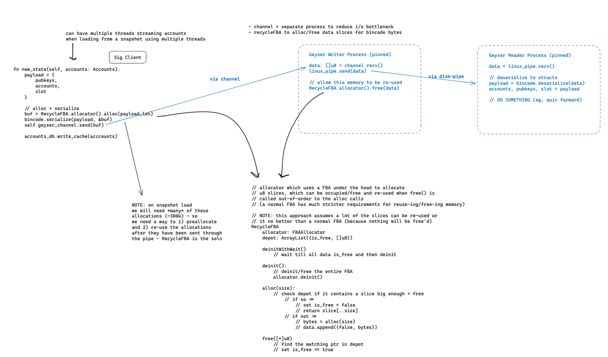

the main code is in `lib.zig` and contains a few key structs:
- `GeyserWriter`: used to write new accounts 
- `GeyserReader`: used to read new accounts 

both use linux pipes to stream data. this involves
opening a file-based pipe using the `mkfifo` syscall which is then 
written to like any other file. the key method used to setup 
the pipes is `openPipe` in `src/geyser/core.zig`.

## cli commands

while running, grafana stats will be available. the main binary code is in 
`src/geyser/main.zig`

### benchmarking 

we also have benchmarking to measure the throughput of geyser. you can run it using 

```bash 
zig build -Doptimize=ReleaseSafe
./zig-out/bin/benchmark geyser
```

you can also benchmark an dummy reader

```bash
# in terminal 1 -- read the snapshot accounts to geyser
./zig-out/bin/sig snapshot-validate -g data/genesis-files/testnet_genesis.bin --enable-geyser -a 250 -t 2

# in terminal 2 -- benchmark how fast you can read
./zig-out/bin/geyser benchmark
```

### dump a snapshot to csv

after downloading a snapshots, you can dump the accounts to a csv using the 
csv geyser command, for example:

```bash
# in terminal 1 -- read the snapshot accounts to geyser
./zig-out/bin/sig snapshot-validate -g data/genesis-files/testnet_genesis.bin --enable-geyser -a 250 -t 2

# in terminal 2 -- dump accounts to a csv (validator/accounts.csv)
./zig-out/bin/geyser csv
# OR dump only specific account owners (ie, the drift program)
./zig-out/bin/geyser csv -o dRiftyHA39MWEi3m9aunc5MzRF1JYuBsbn6VPcn33UH
```

## Architecture

### how data is written/read

currently, data is serialized and written through the pipe using `bincode`

data is organized to be written as `[size, serialized_data]` 

where `size` is the full length of the `serialized_data`

this allows for more efficient buffered reads where you can read the first 8 bytes in 
the pipe, cast to a u64, allocate a buffer of that size and then read the rest of 
the data associated with that payload.

the key struct used is `AccountPayload` which uses a versioned system to support different payload types (`VersionedAccountPayload`) while also being backwards compatibility.

### GeyserWriter



#### IO Thread

the writer uses a separate thread to write to the pipe due to expensive i/o operations.
to spawn this thread, use the `spawnIOLoop` method.

it loops, draining the channel for payloads with type (`[]u8`) and then writes the bufs to the pipe and then frees the payload using the `RecycleFBA`

#### RecycleFBA 

one of the most common operations when streaming accounts is to allocate a buffer to serialize
the `AccountPayload` into and then free the buffer after the bytes have been written to the pipe.

to write accounts out fast, we preallocate a slice of memory which we re-use for serialization throughout the 
geyser's lifetime. This logic is encapsulated in the `RecycleFBA` struct.

the `RecycleFBA` struct uses a fixed buffer allocation strategy but, for each allocation that occurs, it tracks the buffer and whether it is occupied or free.

```zig
alloc_allocator: std.heap.FixedBufferAllocator,
records: std.ArrayList(struct { is_free: bool, buf: []u8 }),
```

when requesting a new slice of memory from the recycle allocator, it will check for a record
which is free and the buf is large enough. If there is no record that fits these conditions
then it will allocate a new slice using the fixed buffer allocator and track it in the 
records field.

when free is called, we find the buffer in the records and set the record's `is_free = true`.

#### usage 

```zig 
// setup writer
var stream_writer = try GeyserWriter.init(
    allocator,
    "test-data/stream_test.pipe",
    exit,
    1 << 18, // 256kb
);
defer stream_writer.deinit();

try stream_writer.spawnIOLoop();

const v_payload = VersionedAccountPayload{
    .AccountPayloadV1 = .{
        .accounts = accounts,
        .pubkeys = pubkeys,
        .slot = 100,
    },
};
// write to the pipe (alloc with recycleFBA + serialize with bincode + send to IO thread)
try stream_writer.writePayloadToPipe(v_payload);
```

### GeyserReader

the reader has two main buffers: 
- `io_buf` : which is used to read from the pipe into this buf
- `bincode_buf` : which is used for bincode allocations 

for example, pseudocode would be: 
```
read(pipe_fd, &io_buf)

// deseriazing with bincode is not zero-copy so to reduce allocations we use
// a fixed buffer allocation strategy
allocator = FixedBufferAllocator.init(&bincode_buf)
payload = bincode.deserialized(&io_buf, allocator, AccountPayload)
```

before reading the io_buf, since we know how much bytes to read for the full payload (see data section), we can resize the io_buf if its not big enough.

if the bincode_buf is not big enough then we double the buffer length and try again since
we dont know exactly how many bytes we will need.

## Metrics

we use a few metrics to understand how fast data is being written/read:

- 'MB/Sec': how many bytes the reader/writer is reading/writing per second
- 'Payloads': how many payloads the reader/writer has read/wrote

we also have metrics to understand what could be causing slow reads/writes (specific stalls/no-op conditions):

- 'Reader Stalls': How many times the reader has tried to read a payload but was unable to because 
the pipe was empty
- 'Writer Stalls': How many times the writer has tried to write a payload but was unable to because
either 
    - the pipe was full ('pipe_full')
    - ther recycle_fba doesnt have any memory available to write the bincode bytes ('no_memory_available')

the reader has dynamic state which uses up some memory (ie, if the buffer isnt big enough to read the incoming data, we resize and try again):

- 'Reader State': The reader has two buffers for state, the 'io_buf' is used to read data from
the pipe, and 'bincode_buf' is used to deserialize the data from the io_buf into this buffer