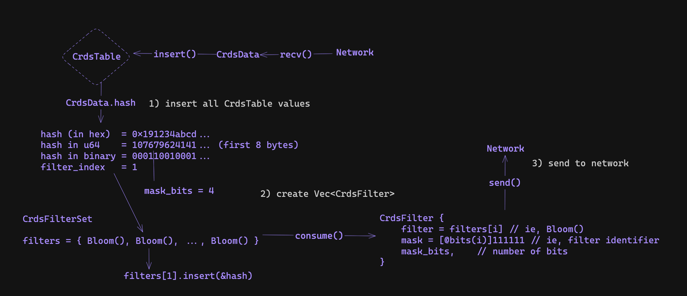
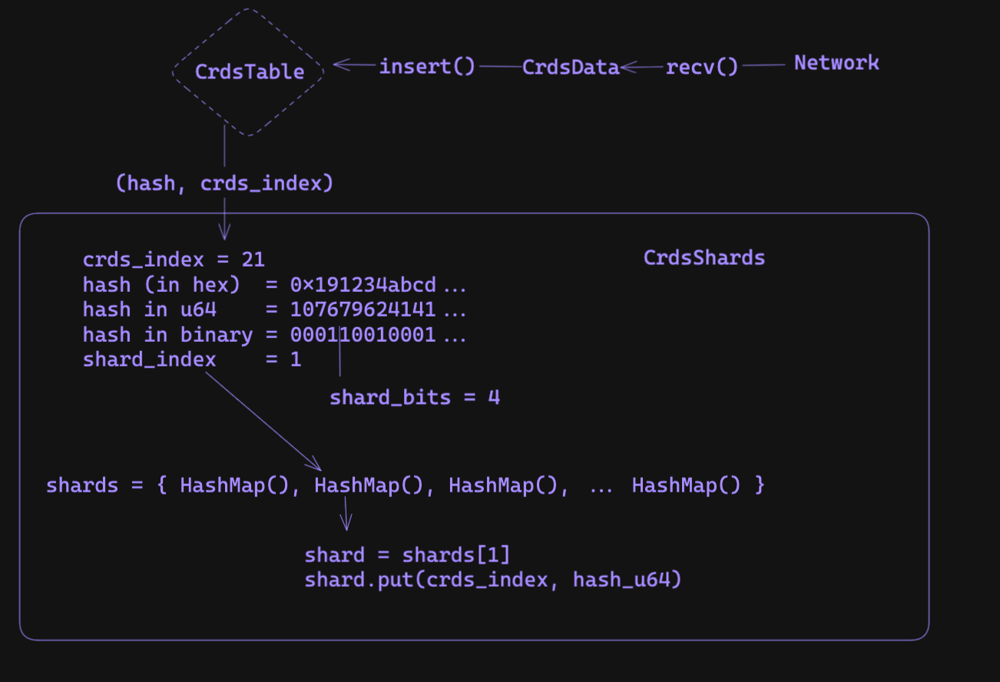

# Sig Gossip - Solana's gossip protocol notes

The Solana gossip protocol is a variation of the ["Plum Tree"](https://www.dpss.inesc-id.pt/~ler/reports/srds07.pdf).

### `ClusterInfo::run_socket_consume` - Packets consumed from UdpSocket

This function is called and `spawn`ed and is a long running process. It's where all UDP packets are consumed into batches. Once consumed, they're deserialized into `Protocol` messages and pushed to the sender channel for processing.

### `ClusterInfo::run_listen` - Listens for Packet's to process

This function `spawn`ed and is a long running process. It listens to the packet receiver channel and then processes packets as they're pushed.

## File outline 

- `crds_table.zig`: where gossip data is stored 
- `crds.zig`: various gossip data structure definitions 
- `pull_request.zig`: logic for sending pull *requests* 
- `pull_response.zig`: logic for sending pull *responses* (/handling incoming pull requests)
- `crds_shards.zig`: datastructure which stores gossip data hashes for quick lookup - used in `crds_table` and constructing pull responses

## Datatypes and Datastructures

- data types which we track are defined in `crds.zig` which include `CrdsData` and `CrdsValue`
    - a `CrdsData` is an enum over the possible gossip data types 
    - a `CrdsValue` contains a `CrdsData` struct and a signature of the `CrdsData` - these are propogated on the network and their signature is verified before processing their data.

- there are many `CrdsData` types used throughout the codebase, but ones of particular importance include:
    - `ContactInfo`/`LegacyContactInfo`: which includes node specific information such as the nodes public key and socket addresses for specific validator tasks (including gossip, tvu, tpu, repair, ...). This structure is critical for discovering the rest of the network. 
    - `Vote`: which includes a validators signature that a specific block is valid. Note, this data is slowly being phased out of the gossip protocol because its not required and takes up a lot of network bandwidth.
    - `EpochSlots`: ?? 
    - `DuplicateShred`: ?? 

### Storing Gossip Data 

- gossip data is stored in a Conflict-free Replicated Data Store (CRDS) located in `crds_table.zig`.
- to store this data we use an indexable HashMap which uses a `CrdsValueLabel` as 
its keys and a `CrdsVersionedValue` as its values

### ValueLabels and VersionedValues 

- each `CrdsData` type has a corresponding `CrdsValueLabel` which defines how the data is stored/replaced 
- for example a `LegacyContactInfo` struct includes many socket address fields, however, its corresponding label is only its pubkey

```zig=
// the full contact info struct (including pubkeys, sockets, and more)
pub const LegacyContactInfo = struct {
    id: Pubkey,
    /// gossip address
    gossip: SocketAddr,
    /// address to connect to for replication
    tvu: SocketAddr,
    /// address to forward shreds to
    tvu_forwards: SocketAddr,
    /// address to send repair responses to
    repair: SocketAddr,
    /// transactions address
    tpu: SocketAddr,
    //...
}

// the corresponding label (only the Pubkey)
pub const CrdsValueLabel = union(enum) {
    LegacyContactInfo: Pubkey,
    //...
}
```

- assuming each validator corresponds to one pubkey, this means we'll only store one `ContactInfo` per validator. 
- when inserting a `CrdsData` whos label already exist in the table, we keep the one with the largest wallclock time (ie, the newest) and discard the other.

### Storing Specific Data Types

- were also interested in storing specific datatypes in the table efficiently
- for example, when broadcasting data to the rest of the network, it would be nice to have all the `ContactInfo` values which are stored in the CRDS table 
- this is why we use an **indexable** hash map implementation 

  - for example, when inserting values into the table, we recieve its corresponding index from the insertion (`crds_index = crds_table.insert(&versioned_value)`)
  - we can then store these indexs in an array (`contact_infos.append(crds_index)`)
  - to retrieve these values, we can iterate over the array, index into the table, and retrieve the correspoinding data values (`versioned_value = crds_table[crds_index]`)
  - we follow this approach for all of the data types such as: `ContactInfos`, `Votes`, `EpochSlots`, `DuplicateShreds`, and `ShredVersions`

### Retrieving Data Specific Data Types

- to efficiently retrieve *new* data from the table, we also track a `cursor` variable which is the head of the table and is monotonically incremented on each insert/update
- we can then use getter functions such as, `get_votes_with_cursor`, which allows you to retrieve votes which are past a certain cursor index
- a listener would track their own cursor and periodically call the getter functions to retrieve new values

## Protocol Messages: Pull

### Building Pull *Requests*

- pull request are used to retrieve gossip data which the node is missing - they are sent to random peers periodically and say, "i have these values in my crds table, can you send me anything im missing"
- to say this, we construct a bloom filter over the hashes of values stored in the crds table
  - the majority of code can be found in `pull_requests.zig` and `src/bloom/bloom.zig`

- since there are a lot of values in the crds table, instead of constructing one large bloom filter to send to all validators, we partition the crds data across multiple filters based on the hash value's first `N` bits 
  - we do this with the `CrdsFilterSet` struct which is a list of `CrdsFilters`
- for example, if we are paritioning on the first 3 bits of hash values we would use, 2^3 = 8 `Bloom` filters: 
    - the first bloom containing hash values whos bits start with 000
    - the second bloom containing hash values whos bits start with 001
    - ... 
    - and lastly, the eight bloom containing hash values whos bits start with 111
- for example, if we were tracking a `Hash` with bits 00101110101, we would only consider its first 3 bits, 001, and so we would add the hash to the first bloom filter (`@cast(usize, 001) = 1`)
- you can think of this as a custom hash function for a hash map, where the keys are `Hash` values, the values are `Bloom` filters, and the function is to consider the first `N` bits of the hash
- the first `N` bits is called the `mask_bits` in the code which depends on many factors including the desired false-positive rate of the bloom filters, the number of items in the crds table, and more 
- after we construct this filter set (ie, compute the `mask_bits` and init `2^mask_bits` bloom filters), we then need to track all of the `CrdsValues` to it
- some psuedocode is below

<div align="center">

</div>

```python 
## main function for building pull requests
def build_crds_filters(
    crds_table: *CrdsTable
) Vec<CrdsFilters>: 
    
    values = crds_table.values() 
    filter_set = CrdsFilterSet.init(len(value))

    for value in values: 
        filter_set.add(value)

    # CrdsFilterSet => Vec<CrdsFilters>
    return filter_set.consumeForCrdsFilters()

class CrdsFilterSet(): 
    mask_bits: u64
    filters: Vec<Bloom>
    
    def init(self, num_items):
        self.mask_bits = ... # compute the mask_bits
        n_filters = 1 << mask_bits # 2^mask_bits 
        
        self.filters = []
        for i in 0..n_filters: 
            self.filters.append(Bloom.random())
            
    def add(hash: Hash):
        # compute the hash index (ie, the first mask_bits bits of the Hash)
        # eg:
        # hash: 001010101010101..1
        # mask_bits = 3 
        # shift_bits = 64 - 3 (note: u64 has 64 bits)
        # hash >> shift_bits = 001 (first three bits) = index 1 
        # == filters[1].add(hash)
        shift_bits = 64 - mask_bits 
        index = @as(usize, hash >> shift_bits)
        self.filters[index].add(hash)
```

- after adding all values to the `CrdsFilterSet`, we then need to consume the set into a vector of `CrdsFilters` which we'll send to different peers
- to idenitfy which hash bits each filter contains, we use a mask
  - eg, the mask of the first filter would be `000`, the mask of the second filter would be `001`, the third filter would be `010`, ...

```python
    def consumeForCrdsFilters(self: CrdsFilterSet) Vec<CrdsFilters>:
        for index in 0..len(self.filters): 
            crds_filter = CrdsFilter( 
                bloom=self.filters[index], 
                mask=CrdsFilter.compute_mask(index, self.mask_bits),
                mask_bits=self.mask_bits,
        )
```

- the logic follows similar to the bit operations above and is computed in `CrdsFilter.compute_mask(index, self.mask_bits)`

```python 
fn compute_mask(index: u64, mask_bits: u64) u64: 
    # shift the index to the first `mask_bits` of the u64
    # eg, 
    # index = 1 
    # mask_bits = 3 
    # shift_bits = 64 - 3 (note: u64 has 64 bits)
    shift_bits = 64 - mask_bits 
    # shifted_index = 1 << (64 - 3) = 001000000000000...0
    shifted_index = index << shift_bits 
    # ones = 000111111111111..1
    ones = (~@as(u64, 0) >> @as(u6, @intCast(mask_bits)))
    # result = 001111111111111..1
    return shifted_index | ones;
```
- notice how the result will be ones everywhere except for the first `mask_bits` bits, which represent the index
- after getting the vector of filters, we send each filter out to a random peer weighted by stake weight

### Building Pull *Responses*

- sending a pull *response* requires you to iterate over values stored in the Crds table, filter the values to match the `CrdsFilter`'s `mask`, and find values which are not included in the request's `Bloom` filter 
- the main function which we use is `filter_crds_values` which takes a `CrdsFilter` as input and returns a vector of `CrdsValues`
    - first it calls `crds_table.get_bitmask_matches` which returns the entries in the crds table which match the filters `mask`
    - to do this efficiently, we introduce a new data structure called `CrdsShards` which is located in `crds_shards.zig` 

#### `CrdsShards`

- `CrdsShards` stores hash values efficiently based on the first `shard_bits` of a hash value (similar to the `CrdsFilterSet` structure)
- the main structure is `shards = [4096]AutoArrayHashMap(usize, u64),` where `shards[k]` includes crds values which the first `shard_bits` of their hash value is equal to `k`
  - `usize` is the index of the value in the crds table 
  - and `u64` is the hash value represented as a `u64`
  - also note that `shard_bits` is hardcoded in the program as `12`, so we will have 2^12 = 4096 shard indexs

- whenever we insert a new value in the `CrdsTable`, we insert its hash value into the `CrdsShard` structure and so the struct is stored on the `CrdsTable`
- the insertion logic is straightforward 
    - take the first 8 bytes of a hash and cast it to a `u64` (`hash_u64 = @as(u64, hash[0..8])`)
    - compute the first `shard_bits` bits of the `u64` by computing `shard_index = hash_u64 >> (64 - shard_bits)`
    - get the shard: `self.shards[shard_index]`
    - insert the crds table index along with the `u64_hash`

```python 
def insert(self: *CrdsShards, crds_index: usize, hash: *const Hash):
    shard_index = @as(u64, hash[0..8]) >> (64 - shard_bits)
    shard = self.shard[shard_index]
    shard.put(crds_index, uhash);
```

<div align="center">

</div>

- now to build the pull response, we need to retrieve hash values which match a `mask` (ie, their first `mask_bit` bits are equal to `mask`)
- when `shard_bits == mask_bits` its very straightforward, we just lookup the shard corresponding to the first `shard_bits` of `mask` and return its values

<div align="center">

</div>

```python 
def find_matches(self: *CrdsShards, mask: u64, mask_bits: u64) Vec<usize>: 
    if (self.shard_bits == mask_bits) {
        shard = self.shard[(mask >> (64 - self.shard_bits)]
        crds_indexs = shard.keys()
        return crds_indexs
    } else { 
        # TODO: 
    }
```

- when `shard_bits < mask_bits`, the mask is tracking more bits than the shards are, so we know if we truncate the mask up to `shard_bits`, we can grab the shard and iterate over those values and to find exact matches
    - truncating and looking up the shard gives us hashes which have a matching first `shard_bits`
    - we then need to check to make sure the last `shard_bits - mask_bits` match the mask which we do through iteration 

<div align="center">

</div>

```python
def find_matches(self: *CrdsShards, mask: u64, mask_bits: u64) Vec<usize>: 
    # ones everywhere except for the first `mask_bits`
    mask_ones = (~0 >> mask_bits)
    
    if (self.shard_bits == mask_bits) {
        # ...
    } else if (self.shard_bits < mask_bits) { 
        # truncate the mask 
        shard_index = mask << (64 - self.shard_bits)
        shard = self.shards[shard_index]
        
        # scan for matches 
        crds_indexs = []
        for (indexs, hash_u64) in shard:
            if ((hash_u64 | mask_ones) == (mask | mask_ones)): # match! 
                crds_indexs.append(indexs)
        return crds_indexs
        
    } else { 
        # TODO
    }
```

- when `shard_bits > mask_bits` the shards is tracking more information than the mask, so we'll need to lookup multiple shards to find all the values which match `mask`
- for example, 
    - if shard_bits = 4 and mask_bits = 2 and our mask is 01
    - the possible shards well need to lookup are: 0100, 0101, 0110, 0111
    - ie, there will be 4 shards that match the mask represented by the difference in bits
    - so, we know we'll have to look up `2^(shard_bits - mask_bits)` number of shards which can be computed using `count = 1 << (shard_bits - mask_bits)`
    - the final shard would be the mask followed by all ones (ie, 0111 in the example above) at the end which can be computed as `end = (mask | mask_ones) >> shard_bits`
    - since we know the final shard and the number of shards were looking for, we can iterate over them from `index = (end-count)..end`

<div align="center">

</div>

```python
def find_matches(self: *CrdsShards, mask: u64, mask_bits: u64) Vec<usize>: 
    # ones everywhere except for the first `mask_bits`
    mask_ones = (~0 >> mask_bits)
    
    if (self.shard_bits == mask_bits) {
        # ...
    } else if (self.shard_bits < mask_bits) { 
        # ...
    } else if (self.shard_bits > mask_bits) { 
        shift_bits = self.shard_bits - mask_bits 
        count = 1 << shift_bits
        end = (mask | mask_ones) >> shard_bits 
        
        crds_indexs = []
        for shard_index in (end-count)..end:
            shard = self.shards[shard_index]
            indexs = shard.keys()
            crds_indexs.append(indexs)
        
        return crds_indexs 
    }
```

- after we have all the crds indexs which match the next check is check which values are not included in the request's bloom filter
- this is fairly straightforward 
- the psuedo code looks like 

```python 

def filter_crds_values(
    crds_table: *CrdsTable
    filter: *CrdsFilter
) Vec<CrdsValues>:
    var match_indexs = crds_table.get_bitmask_matches(filter.mask, filter.mask_bits);
    
    values = []
    for index in match_indexs: 
        entry = crds_table[index]        
        if (!filter.bloom.contains(entry.hash)):
            values.append(entry)

    return values
```

## Push Requests

## Ping/Pong
