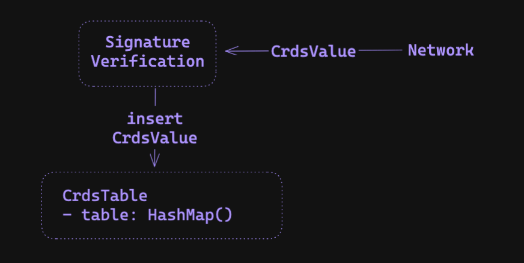
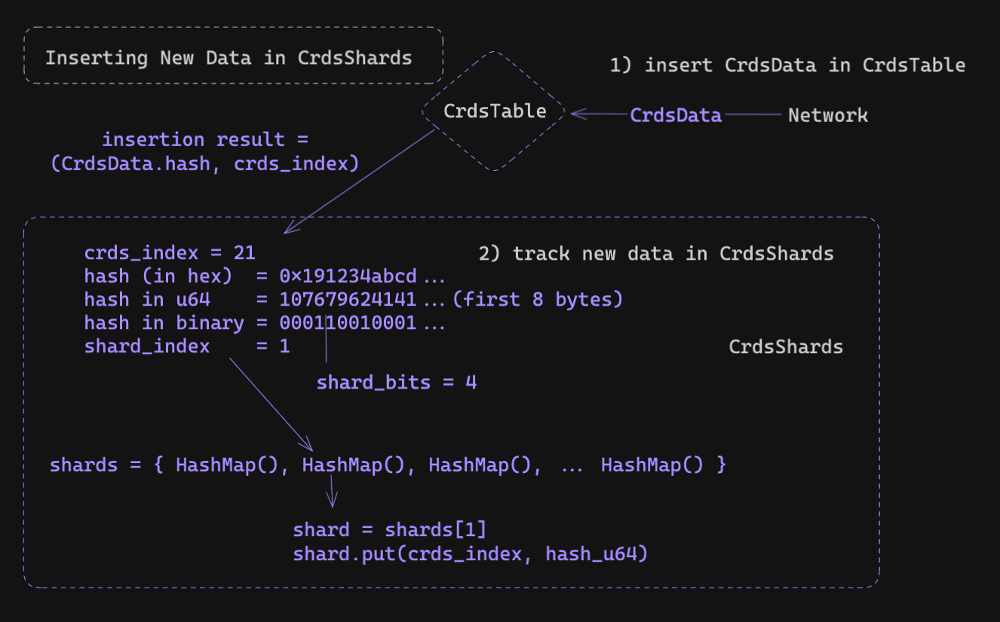
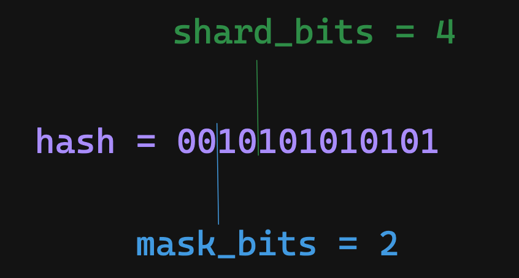
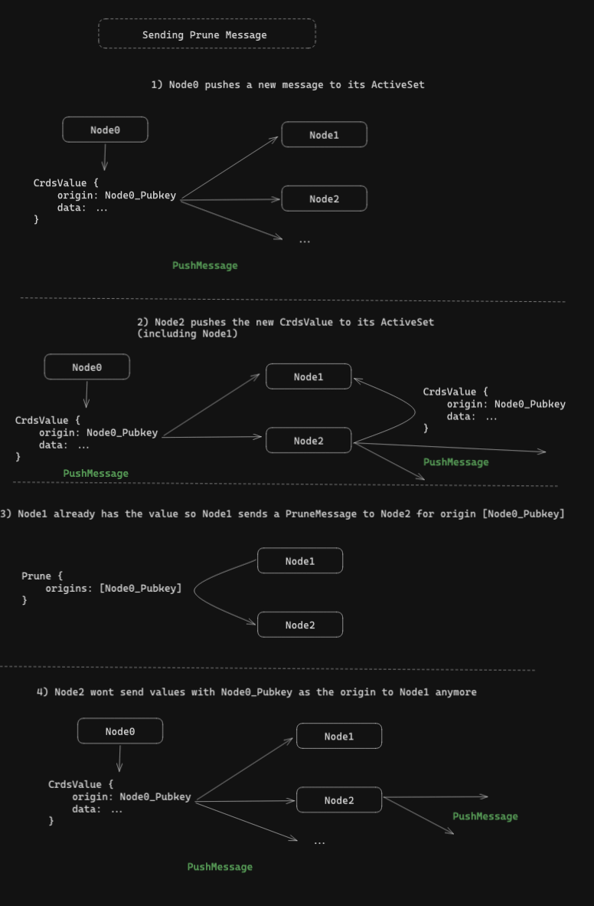
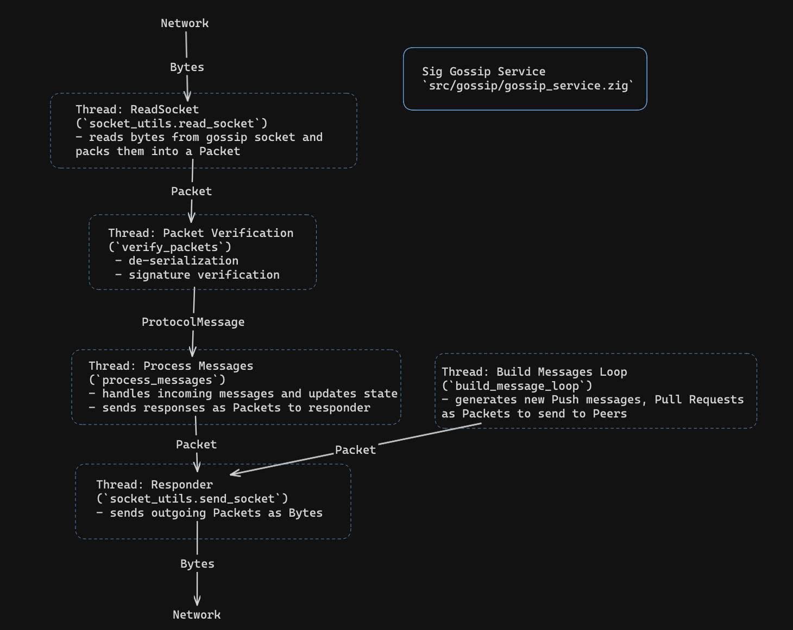

# Solana's Gossip Specification

This post will describe how Solana's gossip protocol works in-depth, as well as implementation details of Sig's gossip.

For an introduction to Solana's gossip protocol, check out the technical sections of our [Sig announcement blog post](https://blog.syndica.io/introducing-sig-by-syndica-an-rps-focused-solana-validator-client-written-in-zig/).

Checkout the full associated blog post here: [https://blog.syndica.io/sig-engineering-1-gossip-protocol/](https://blog.syndica.io/sig-engineering-1-gossip-protocol/).

## Running tests for Gossip Module
To run tests for this module:
```bash
cd src/gossip
zig build test
```

## Repository File Outline 

- `gossip_service.zig`: main logic for reading, processing, and sending gossip messages
- `crds_table.zig`: where gossip data is stored 
- `crds.zig`: various gossip data structure definitions 
- `pull_request.zig`: logic for sending pull *requests* 
- `pull_response.zig`: logic for sending pull *responses* (/handling incoming pull requests)
- `crds_shards.zig`: datastructure which stores gossip data hashes for quick lookup - used in `crds_table` and constructing pull responses
- `active_set.zig`: logic for deriving a list of peers to send push messages to
- `ping_pong.zig`: logic for sending ping/pong messages as a heartbeat check

A gossip spy is, in essence, software written to do two things: store data and send/receive requests.

## Storing Data

### CrdsTable

Solana’s gossip data is stored in a Conflict-free Replicated Data Store (CRDS).

There are two main data types we store (defined in `crds.zig`) which includes `CrdsData` and `CrdsValue` datastructures. A `CrdsData` enum covers various gossip data types including `ContactInfo` for node details like public keys and addresses, `Vote` for block validity signatures (being phased out for lower bandwidth), and more. Secondly, `CrdsValue` holds a `CrdsData` struct and a signature over its data. When processing incoming gossip data from the network, we first verify the signature of the `CrdsValue` and then insert it into the CrdsTable.

<div align="center">

</div>

### Inserting Data: ValueLabels and VersionedValues

To store this data, we use an indexable-HashMap in a struct called the `CrdsTable` located in `crds_table.zig`.

For each `CrdsValue` type we store, there is a corresponding `CrdsValueLabel` which is used as the key for the hashmap and a `CrdsVersionedValue` structure for the value for the hashmap.

#### CrdsTable Keys: `CrdsValueLabel`

To understand how the `CrdsValueLabel` defines how data is stored, we start with an example.

One important data type we care about is the `LegacyContactInfo` struct which includes the publickey of the node and socket address fields that are used to communicate with the node. However, its corresponding `CrdsValueLabel` is only its pubkey. This means we'll only store one `LegacyContactInfo` per `Pubkey` in the CrdsTable (i.e., if we assume that each validator corresponds to one `Pubkey`, then this means we'll only store one contact info struct per validator).

```zig=
// the full contact info struct (including pubkeys, sockets, and more)
pub const LegacyContactInfo = struct {
    id: Pubkey,
    /// gossip address
    gossip: SocketAddr,
    /// address to send repair responses to
    repair: SocketAddr,
    /// transactions address
    tpu: SocketAddr,
    //...
}

// the corresponding label (only the Pubkey)
pub const CrdsValueLabel = union(enum) {
    LegacyContactInfo: Pubkey,
    //...
}
```

When inserting a `CrdsValue`, if an entry with the same corresponding label exists (i.e., a duplicate), we keep the value with the largest wallclock time (i.e., the newest).

### CrdsTable Values: `CrdsVersionedValue`

The `CrdsVersionedValue` structure contains the `CrdsValue` inserted along with other
related information including its hash, timestamps, and more.

```zig
pub const CrdsVersionedValue = struct {
    value: CrdsValue,
    value_hash: Hash,
    timestamp_on_insertion: u64,
    cursor_on_insertion: u64,
};
```

### Reading Stored Data

We’re also interested in reading all stored data of a specific type. For example, when broadcasting data to the rest of the network, we need to retrieve all the contact info values stored in the CrdsTable. This is why we use an **indexable** hash map as our main datastructure.

To do this:
- we insert the value into the CrdsTable and  receive its corresponding index (`crds_index = crds_table.insert(&versioned_value)`)
- we store these indexes in an array corresponding to the specific type we’re tracking (`contact_infos.append(crds_index)`)
- when we want to retrieve these values, we look up all the indexes stored in the array to get the corresponding values (`versioned_value = crds_table[crds_index]`).

We follow this approach for the `ContactInfos`, `Votes`, `EpochSlots`, and `DuplicateShreds` data types.

### Reading New Data

To efficiently retrieve *new* data from the CrdsTable, we also track a `cursor` variable which is monotonically incremented on each insert/update (which is stored on the `CrdsVersionedValue` structure using the `cursor_on_insertion` variable).

For example, a listener would track their cursor and periodically call the getter functions (such as, `get_votes_with_cursor`, which allows you to retrieve vote `CrdsVersionedValue`s which are past a certain cursor index) to retrieve new values.

Note: this is how we produce new push messages - talked about in a later section.


### Bounding Memory Size and Removing Old Values

The CrdsTable is also periodically trimmed to maintain a max number of unique pubkeys (the max number of pubkeys is set to `8192` in the codebase) and remove values with old timestamps, so memory growth is bounded.

We use the field, `CrdsTable.pubkey_to_values`, to track all the CrdsValues in the table associated with a specific node’s pubkey and periodically call `CrdsTable.attempt_trim` to remove all the values associated with the oldest pubkeys when close to capacity. `CrdsTable.remove_old_labels` is called to remove values with old timestamps periodically as well.

In the solana-labs implementation, the gossip pubkeys with the smallest stake weight are removed first, however, we don't have stake weight information yet in Sig. This will be future work.

*Note:* Since we are using an indexable hashmap struct, when removing values we
typically use the `removeSwap` function (defined as: "The entry is removed from the
underlying array by swapping it with the last element and pop-ing"). Since we are
tracking the index of values across multiple arrays, when we `removeSwap`, the last
value is now at a different index than how we recorded it. So, we need to account for the
'swapping with the last element' and update our indexes. The full logic
can be found in `CrdsTable.remove()`.

## Sending/Receiving Requests

We also receive new messages from the network as bytes. Before processing these messages:
-  deserialize them into Protocol messages (defined in `protocol.zig`)
-  verify their values are valid
-  verify the signature corresponds are correct

And if any of these checks fail, we discard the value. Otherwise, we process the protocol message.

*Note:* this logic can be found in the `GossipService.verify_packets` method in `gossip/gossip_service.zig`.

There are 4 protocol messages to describe:
- Pull
- Push
- Prune
- and Ping/Pong

## Protocol Messages: Pull

Pull messages are used to retrieve new data from other nodes in the network. There are two types of Pull messages: pull requests and pull responses.

### Building Pull *Requests*

Pull requests are requests for new data. A pull request contains a representation of the CrdsValues a node currently has, which the receiving node parses and uses to find data which it currently has but is not included in the request.

To represent values that a node currently has, we construct a bloom filter over the values stored in its CrdsTable.

Note: The majority of pull request code can be found in `pull_requests.zig` and `bloom.zig`.

Since the CrdsTable can store a large amount of values, instead of constructing one large bloom filter, we partition the data in the CrdsTable across multiple bloom filters based on the hash value's first `N` bits.

*Note:* When constructing pull requests, in addition to all the values in the CrdsTable, we also include values that were recently overwritten (which is tracked in the `crds_table.pruned` variable), and values that were invalid in a previous pull response (discussed more in the 'Handling Pull Responses' section).

For example, if we are partitioning on the first 3 bits we would use, 2^3 = 8 `Bloom` filters:
  - the first bloom filter would contain hash values whose first 3 bits are equal to 000
  - the second bloom filter would contain hash values whose first 3 bits are equal to 001
  - ...
  - and lastly, the eighth bloom filter would contain hash values whose first 3 bits are equal to 111

If we are tracking a `Hash` with bits `00101110101`, we would only consider its first 3 bits, `001`, and so we would add the hash to the first bloom filter (`@cast(usize, 001) = 1`). 

To implement this we use the `CrdsFilterSet` struct which is a list of `CrdsFilters`. Throughout the codebase, the first bits:
`N`, is called `mask_bits`.
`mask_bits` is a variable that depends on many factors including the desired false-positive rate of the bloom filters, the number of items in the CrdsTable, and more. It
will likely be different for each pull request.

After we construct this filter set (i.e., compute the `mask_bits` and init `2^mask_bits` bloom filters), we add all of the `CrdsValues` in the CrdsTable into the set, and construct a list of `CrdsFilter`s to send to other random nodes.

```python
## main function for building pull requests
def build_crds_filters(
    crds_table: *CrdsTable
) Vec<CrdsFilters>:
	
    values = crds_table.values()
    filter_set = CrdsFilterSet.init(len(value))

    for value in values:
	    filter_set.add(value)

    # CrdsFilterSet => Vec<CrdsFilters>
    return filter_set.consumeForCrdsFilters()

class CrdsFilterSet():
    mask_bits: u64
    filters: Vec<Bloom>
	
    def init(self, num_items):
	    self.mask_bits = ... # compute the mask_bits
	    n_filters = 1 << mask_bits # 2^mask_bits
       
	    self.filters = []
	    for i in 0..n_filters:
    	    self.filters.append(Bloom.random())
   	    
    def add(hash: Hash):
	    # compute the hash index (ie, the first mask_bits bits of the Hash)
	    # eg:
	    # hash: 001010101010101..1
	    # mask_bits = 3
	    # shift_bits = 64 - 3 (note: u64 has 64 bits)
	    # hash >> shift_bits = 001 (first three bits) = index 1
	    # == filters[1].add(hash)
	    shift_bits = 64 - mask_bits
	    index = @as(usize, hash >> shift_bits)
	    self.filters[index].add(hash)
```

To build a vector of `CrdsFilters` from a `CrdsFilterSet`, each `CrdsFilter` will need a bloom filter to represent a subset of the CrdsValues, and a corresponding identifier mask which identifies the hash bits that each filter contains (using a variable called `mask`).

For example, the mask of the first filter would be `000`, the mask of the second filter would be `001`, the third filter would be `010`, ...

When a node receives a pull request, the `mask` is used to efficiently look up all the matching CrdsValues.

For example, if you received the `010` mask, you would look up all hash values whose first 3 bits are `010` and then find values that are not included in the bloom filter. These values would then be used to construct a pull response.

```python
    def consumeForCrdsFilters(self: CrdsFilterSet) Vec<CrdsFilters>:
	    for index in 0..len(self.filters):
    	    crds_filter = CrdsFilter(
        	    bloom=self.filters[index],
        	    mask=CrdsFilter.compute_mask(index, self.mask_bits),
        	    mask_bits=self.mask_bits,
	    )
```

To compute the `mask` of a given filter index, the logic is similar to the bit operations above:

```python
fn compute_mask(index: u64, mask_bits: u64) u64:
    # shift the index to the first `mask_bits` of the u64
    # eg,
    # index = 1
    # mask_bits = 3
    # shift_bits = 64 - 3 (note: u64 has 64 bits)
    shift_bits = 64 - mask_bits
    # shifted_index = 1 << (64 - 3) = 001000000000000...0
    shifted_index = index << shift_bits
    # ones = 000111111111111..1
    ones = (~@as(u64, 0) >> @as(u6, @intCast(mask_bits)))
    # result = 001111111111111..1
    return shifted_index | ones;
```

Notice how the result will be ones everywhere except for the first `mask_bits` bits, which represent the filter's index. After getting the vector of filters, we then send each filter out to a random peer weighted by stake weight.

<div align="center">

</div>

### Building Pull *Responses*

Pull responses are responses to pull requests and include missing data which was not included in the pull request.

To build a pull response, we find values to match the `CrdsFilter`'s `mask`, and filter to only include values that are not included in the request's `Bloom` filter. To find values that match the filter's `mask`, we use the `CrdsShards` struct which is located in `crds_shards.zig`.


<div align="center">

</div>

#### `CrdsShards`

The `CrdsShards` struct stores hash values based on the first `shard_bits` of a hash value (similar to the `CrdsFilterSet` structure and the `mask_bits`). Whenever we insert a new value in
the `CrdsTable`, we insert its hash into the `CrdsShard` structure.

To store these hashes efficiently we use an array of HashMaps (`shards = [4096]AutoArrayHashMap(usize, u64),`) where `shards[k]` includes CrdsValues which the first `shard_bits` of their hash value is equal to `k`.
- The keys in the hash map are of type `usize` which is the CrdsTable index of the hash.
- And the values of the hash map are of type `u64` which represents the hash value represented as a `u64`.

The struct allows us to quickly look up all the CrdsValues whose hash matches a pull request's `mask` (compared to iterating over all the CrdsValues).

*Note:* `shard_bits` is a hardcoded constant in the program equal to `12`, so we will have 2^12 = 4096 shard indexes.

After inserting a new value in the CrdsTable, inserting its hash value into the `CrdsShards` struct is straightforward:
- take the first 8 bytes of a hash and cast it to a `u64` (`hash_u64 = @as(u64, hash[0..8])`)
- compute the first `shard_bits` bits of the `u64` by computing `shard_index = hash_u64 >> (64 - shard_bits)`
- get the corresponding shard: `self.shards[shard_index]`
- insert the CrdsTable index along with the `u64_hash` into the shard

```python
def insert(self: *CrdsShards, crds_index: usize, hash: *const Hash):
    shard_index = @as(u64, hash[0..8]) >> (64 - shard_bits)
    shard = self.shard[shard_index]
    shard.put(crds_index, uhash);
```

<div align="center">

</div>

#### `CrdsShards`: Finding hash matches

To build a Pull Response, we need to retrieve values in the CrdsTable whose hash matches a `mask` (i.e., their first `mask_bit` bits are equal to `mask`).
To find these matches there are three cases we need to consider:
- `shard_bits == mask_bits`
- `shard_bits < mask_bits`
- `shard_bits > mask_bits`

---

When `shard_bits == mask_bits`, we look at the shard corresponding to the first `shard_bits` of `mask` and return its values.

For example, if shard_bits = 3 and mask_bits = 3 and our mask is 001, we can find all the
CrdsTable values whose first 3 bits of their hash value is 001 by looking up shards[1].

<div align="center">

</div>

```python 
def find_matches(self: *CrdsShards, mask: u64, mask_bits: u64) Vec<usize>: 
    if (self.shard_bits == mask_bits) {
        shard = self.shard[(mask >> (64 - self.shard_bits)]
        crds_indexs = shard.keys()
        return crds_indexs
    } else { 
        # TODO: 
    }
```

--- 

When `shard_bits < mask_bits`, the mask is tracking more bits than the shards are, so we can find the shard corresponding to the first `shard_bits` of the `mask`, and iterate over those values to look for exact matches.

I.e., truncating `mask` and looking up the shard gives us hashes that have a matching first `shard_bits`. We then need to check to make sure the last `shard_bits - mask_bits` match the mask, which we do through iteration.

For example, if shard_bits = 3 and mask_bits = 5 and our mask is 00101, we would first find all the CrdsTable values whose first 3 bits of their hash value is 001 by looking up shard[1]. We would then iterate over those values and make sure the fourth and fifth bits of the hash are 01.

<div align="center">

</div>

```python
def find_matches(self: *CrdsShards, mask: u64, mask_bits: u64) Vec<usize>: 
    # ones everywhere except for the first `mask_bits`
    mask_ones = (~0 >> mask_bits)
    
    if (self.shard_bits == mask_bits) {
        # ...
    } else if (self.shard_bits < mask_bits) { 
        # truncate the mask 
        shard_index = mask << (64 - self.shard_bits)
        shard = self.shards[shard_index]
        
        # scan for matches 
        crds_indexs = []
        for (indexs, hash_u64) in shard:
            if ((hash_u64 | mask_ones) == (mask | mask_ones)): # match! 
                crds_indexs.append(indexs)
        return crds_indexs
        
    } else { 
        # TODO
    }
```

--- 

When `shard_bits > mask_bits`, the shards is tracking more information than the mask, so we'll need to look at multiple shards to find all the values that match `mask`.

For example,
  - if shard_bits = 4 and mask_bits = 2 and our mask is 01
  - the possible shards we'll need to lookup are: 0100, 0101, 0110, 0111
  - i.e., there will be 4 shards that match the mask represented by the difference in bits
  - so, we know we'll have to look up `2^(shard_bits - mask_bits)` number of shards which can be computed using `count = 1 << (shard_bits - mask_bits)`
  - the largest shard value would be the mask followed by all ones (ie, 0111 in the example above) at the end which can be computed as `end = (mask | mask_ones) >> shard_bits`
  - since we know the largest shard and the number of shards were looking for, we can iterate over them from `index = (end-count)..end`


<div align="center">

</div>

```python
def find_matches(self: *CrdsShards, mask: u64, mask_bits: u64) Vec<usize>: 
    # ones everywhere except for the first `mask_bits`
    mask_ones = (~0 >> mask_bits)
    
    if (self.shard_bits == mask_bits) {
        # ...
    } else if (self.shard_bits < mask_bits) { 
        # ...
    } else if (self.shard_bits > mask_bits) { 
        shift_bits = self.shard_bits - mask_bits 
        count = 1 << shift_bits
        end = (mask | mask_ones) >> shard_bits 
        
        crds_indexs = []
        for shard_index in (end-count)..end:
            shard = self.shards[shard_index]
            indexs = shard.keys()
            crds_indexs.append(indexs)
        
        return crds_indexs 
    }
```

After we have all the CrdsValue indexes that match the `mask`, we then check which values are not included in the request's bloom filter (i.e., values that the node is missing).

```python

def filter_crds_values(
    crds_table: *CrdsTable
    filter: *CrdsFilter
) Vec<CrdsValues>:
    # find crds values whose hash matches the mask 
    var match_indexs = crds_table.get_bitmask_matches(filter.mask, filter.mask_bits);
	
    # find the values that arent included in the requests bloom filter
    values = []
    for index in match_indexs:
	    entry = crds_table[index]       
	    if (!filter.bloom.contains(entry.hash)):
    	    values.append(entry)

    return values
```

### Handling Pull Responses

When receiving a pull response, we insert all the values received in the CrdsTable. If any values fail to be inserted (due to having an old wallclock time, or being duplicate data), we track their hash in an array `failed_pull_hashes`. These failed hash values are then used when constructing the next Pull Request so that the values are not sent again. To ensure memory doesn’t grow without bounds, the `failed_pull_hashes` array is periodically trimmed to remove old values.

We also do the same thing for values that are pruned in the CrdsTable (i.e., values that are overwritten) in `CrdsTable.pruned`.

For each CrdsValue that is successfully inserted in the CrdsTable, we also update the timestamps for all the values from that origin pubkey. We do this so that when we are trimming old CrdsValues in the table, we don't remove values from an active pubkey.

## Protocol Messages: Push

### Sending Push Messages

Push messages are periodically generated to send out new data to a subset of the network’s nodes. To implement this, we track a `push_cursor` variable which represents the
cursor value of the last pushed value, and use the getter function `crds_table.get_entries_with_cursor(...)` to get newCrdsValues which have been inserted past this value (i.e., are new CrdsValues).

In Sig, a `PushMessage` is defined as `struct { Pubkey, []CrdsValue }`: a source pubkey, and an array of `CrdsValue`s. The source pubkey will be the same pubkey on the local node's contact information. And the array of values will be all the new CrdsValues.

An important note is that all messages sent through gossip should be less than or equal to a [maximum transmission unit (MTU)](https://en.wikipedia.org/wiki/Maximum_transmission_unit) of 1280 bytes (which is referred to as the `Packet` struct throughout the codebase).

Because sometimes there are more CrdsValues to push than can fit inside one of these packets (i.e., `bytes([]CrdsValue) > MTU`), the CrdsValues are partitioned into packet-sized chunk `PushMessages` which are then serialized across multiple `Packets` instead of one large packet.

These values are then sent as a `PushMessage` to all the nodes in the local node's `ActiveSet` struct.

### Data Structures: Active Set

A node's active set is a list of nodes in the gossip network with a shred version equal to the local nodes (i.e., a variable used to track hard-forks), with valid gossip ports, and other details. The ActiveSet is a key part of the PlumTree algorithm, which enables data to be propagated in a tree-like structure instead of a full broadcast.

The active set is periodically re-sampled to reduce the chance of eclipse attacks.

Note: see the “Receiving Prune Messages” section for a more detailed explanation on how the `ActiveSet` is constructed on a per-crds-value-origin basis.

Note: The solana-labs rust implementation uses stake weight information to build their `ActiveSet`. However, since Sig doesn’t have stake weight information yet, we chose to randomly sample.

<div align="center">

</div>

#### Solana-Labs' Active Set

For completeness, the [solana-labs client's `ActiveSet` implementation](https://github.com/solana-labs/solana/blob/master/gossip/src/push_active_set.rs) is also worth discussing. Their `PushActiveSet` contains multiple `PushActiveSetEntry` structs where each `Entry` corresponds to a different probability distribution over possible nodes to be included in the active set. 

The entries distribution is ordered by decreasing entropy over stake weight. Meaning, entries at the start of the list (with a low index - eg, 0, 1) are a uniform distribution over the possible nodes (with high entropy) and entries at the end of the list (with a large index - eg, 24, 25) have a distribution weighted strongly by a node's stake amount (with low entropy).

When building the active set, the local node's stake weight decides which entry to sample the nodes from. For example, if the local node has a large stake, its index will be large which corresponds to a distribution that has a higher probability of selecting another high-staked node to be included in the active set. 

This means, **high-stake nodes are more likely to send push messages to other high-stake nodes, while low-stake nodes send push messages to random nodes**.

<div align="center">

</div>

### Receiving Push Messages

When receiving a new `PushMessage`, the values are inserted into the CrdsTable and values that failed the insertion (due to being a duplicate) are tracked. The nodes who sent those failed values are then sent prune messages to say, 'stop sending me this data, I’ve already received it from another node’.

## Protocol Message: Prune Messages

### Sending Prune Message

A Prune message is defined as follows:

```zig=
pub const PruneData = struct {
    /// Pubkey of the node that sent this prune data
    pubkey: Pubkey,
    /// Pubkeys of origins that should no longer be sent to pubkey
    prunes: []Pubkey,
    /// Signature of this Prune Message
    signature: Signature,
    /// The Pubkey of the intended node/destination for this message
    destination: Pubkey,
    /// Wallclock of the node that generated this message
    wallclock: u64,
}
```

The comments explain most of the variables in the struct. The `prunes` field a list of `origin` pubkeys (pubkeys of the node which create a corresponding CrdsValue). When inserting the received values from a new push message, if a CrdsValue fails to be inserted into the CrdsTable, the `origin` of the value (i.e., the pubkey of the node that created the value) is added to the prunes list. And lastly, the destination field is set to the node which sent the push message.

```python
def handle_push_message(
    from_pubkey: Pubkey, # received from
    values: []CrdsValues, # values from push msg
    my_pubkey: Pubkey, # local nodes pubkey
    crds_table: *CrdsTable,
) {
    pruned_origins = []
    for value in values:
	    result = crds_table.insert(value)
	    if result.is_error():
    	    origin = value.id()
    	    pruned_origins.append(origin)

    return PruneMessage {
	    prunes: pruned_origins,
	    destination: from_pubkey,
	    pubkey: my_pubkey,
    }
}
```


<div align="center">

</div>

*Note:* in the solana-labs client, to compute what nodes to send a prune message to, the client uses the number of duplicates sent, along with the nodes stake weight and a minimum number of nodes to keep. Since Sig doesn't have stake weight information, we follow a simpler approach and prune any values that fail insertion.

### Receiving Prune Messages

When a prune message is received, we track which `from_address` pruned a specific `origin` using a `HashMap(from_address: Pubkey, origin_bloom: Bloom)` where  `from_address: Pubkey` is the address which sent the prune message to a `Bloom` filter which origins are inserted into.

When constructing the active set for a CrdsValue:
- we find the `origin` of that value
- iterate over the peers in the active set
- look up the peer in the hashmap to find their corresponding bloom filter
- and check if the origin of the CrdsValue is contained in the bloom filter
 - if the origin is not contained in the bloom filter, we haven’t received a corresponding prune message, so we add the peer to the active set
  - if the origin is contained in the bloom filter, we don’t add the peer to the active set

## Protocol Message: Ping/Pong

Ping and Pong messages are used to health check nodes quickly and easily. The corresponding logic is defined in `gossip/ping_pong.zig`.

Ping messages are periodically sent to all of the nodes in the network (by parsing the contact information in the CrdsTable). For each of these Ping messages, a corresponding Pong message is expected within a certain amount of time. If we fail to receive the corresponding Pong message, then we don’t send that node any other protocol messages (i.e., we don’t include them in the `ActiveSet` so we don’t send them push messages, nor do we respond to any pull requests received from them).

We track the nodes that have responded to Ping messages with a corresponding Pong message as well as which nodes we are still waiting for a corresponding Pong message for using the `PingCache` structure.

### PingCache

The `PingCache` defines a few important variables including the amount of time a received pong is valid for  (i.e., when the node should send a new ping message) which is set to 1280 seconds, and the rate limit for how often to send Ping messages which is set to only send Ping messages every 20 seconds.


## `GossipService` implementation at a high level

The following diagram shows the overall implementation design of the `GossipService` of Sig which handles receiving, processing, and sending gossip messages. 

<div align="center">

</div>
