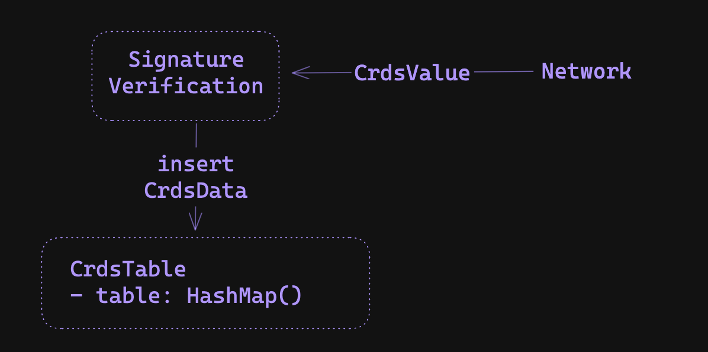

# Sig Gossip - Solana's gossip protocol notes

The Solana gossip protocol is a variation of the ["Plum Tree"](https://www.dpss.inesc-id.pt/~ler/reports/srds07.pdf).

### `ClusterInfo::run_socket_consume` - Packets consumed from UdpSocket

This function is called and `spawn`ed and is a long running process. It's where all UDP packets are consumed into batches. Once consumed, they're deserialized into `Protocol` messages and pushed to the sender channel for processing.

### `ClusterInfo::run_listen` - Listens for Packet's to process

This function `spawn`ed and is a long running process. It listens to the packet receiver channel and then processes packets as they're pushed.

## File outline 

- `crds_table.zig`: where gossip data is stored 
- `crds.zig`: various gossip data structure definitions 
- `pull_request.zig`: logic for sending pull *requests* 
- `pull_response.zig`: logic for sending pull *responses* (/handling incoming pull requests)
- `crds_shards.zig`: datastructure which stores gossip data hashes for quick lookup - used in `crds_table` and constructing pull responses

## Gossip Datastructures and Datatypes

### CrdsTable: Storing Gossip Data 

Gossip data is stored in a indexable-HashMap which is refered to as a Conflict-free Replicated Data Store (CRDS) located in `crds_table.zig`. 

The data types we are tracking are defined in `crds.zig` which includes `CrdsData` and `CrdsValue` datastructures. A `CrdsData` enum covers various gossip data types (including `ContactInfo` for node details like public keys and addresses, `Vote` for block validity signatures (being phased out for lower bandwidth), and more), while `CrdsValue` holds a `CrdsData` struct and a signature over its data.

<div align="center">

</div>


### Inserting Data: ValueLabels and VersionedValues 

For each `CrdsData` type, there is a corresponding `CrdsValueLabel` which defines how the data is stored/replaced. When inserting `CrdsData` values into the CRDS table HashMap, we use the `CrdsValueLabel` structure as the keys and a `CrdsVersionedValue` structure for the values.

#### CrdsTable Keys: `CrdsValueLabel`

For example, a `LegacyContactInfo` struct includes many socket address fields, however, its corresponding `CrdsValueLabel` is only its pubkey. If we assume that each validator corresponds to one `Pubkey`, this means we'll only store one `LegacyContactInfo` per validator in the CRDS table. 

```zig=
// the full contact info struct (including pubkeys, sockets, and more)
pub const LegacyContactInfo = struct {
    id: Pubkey,
    /// gossip address
    gossip: SocketAddr,
    /// address to connect to for replication
    tvu: SocketAddr,
    /// address to forward shreds to
    tvu_forwards: SocketAddr,
    /// address to send repair responses to
    repair: SocketAddr,
    /// transactions address
    tpu: SocketAddr,
    //...
}

// the corresponding label (only the Pubkey)
pub const CrdsValueLabel = union(enum) {
    LegacyContactInfo: Pubkey,
    //...
}
```

To handle duplicate labels, when inserting a `CrdsData` whos label already exist in the table, we keep the value with the largest wallclock time (ie, the newest).

### CrdsTable Values: `CrdsVersionedValue`

The `CrdsVersionedValue` structure contains the value inserted along with other 
related information including its hash, timestamps, and more. 

```zig 
pub const CrdsVersionedValue = struct {
    value: CrdsValue,
    value_hash: Hash,
    timestamp_on_insertion: u64,
    cursor_on_insertion: u64,
    /// Number of times duplicates of this value are recevied from gossip push.
    num_push_dups: u8,
};
```

### Efficient DataType Retrieval 

Were also interested in storing specific Crds types in a way which allows for efficient retrieval. 
For example, when broadcasting data to the rest of the network, it would be nice to ge all the `ContactInfo` values which are stored in the CRDS table.
This is why we use an **indexable** hash map as our main datastructure.

For example, when inserting values into the table, we recieve its corresponding index from the insertion (`crds_index = crds_table.insert(&versioned_value)`)
We can then store these indexs in an array (`contact_infos.append(crds_index)`). Then when we want to retrieve these values, 
we can iterate over the array's values, index into the table, and retrieve the correspoinding data values (`versioned_value = crds_table[crds_index]`).
We follow this approach for the `ContactInfos`, `Votes`, `EpochSlots`, and `DuplicateShreds` data types.

### Retrieving New Data

To efficiently retrieve *new* data from the table, we also track a `cursor` variable which is monotonically incremented on each insert/update.
Note the cursor value is tracked in the `CrdsVersionedValue` structure using the `cursor_on_insertion` variable.
We can then use getter functions such as, `get_votes_with_cursor`, which allows you to retrieve vote `CrdsVersionedValue`s which are past a certain cursor index.
For example, a listener would track their own cursor and periodically call the getter functions to retrieve new values.

## Protocol Messages: Pull

There are two types of Pull messages, Pull requests and Pull responses. Pull request messages request CRDS data which a node is missing. Pull response messages 
are responses to Pull requests and include the missing data. 

### Building Pull *Requests*

To represent values which a node currently has, we construct a bloom filter over the values stored in the CRDS table.
The majority of pull request code can be found in `pull_requests.zig` and `src/bloom/bloom.zig`.

Since the crds table can store a large amount of values, instead of constructing one large bloom filter, 
we partition the data in the crds table across multiple bloom filters based on the hash value's first `N` bits.

For example, if we are paritioning on the first 3 bits we would use, 2^3 = 8 `Bloom` filters: 
  - the first bloom containing hash values whos bits start with 000
  - the second bloom containing hash values whos bits start with 001
  - ... 
  - and lastly, the eight bloom containing hash values whos bits start with 111

If we were tracking a `Hash` with bits `00101110101`, we would only consider its first 3 bits, `001`, and so we would add the hash to the first bloom filter (`@cast(usize, 001) = 1`)

Implementing this we use the `CrdsFilterSet` struct which is a list of `CrdsFilters`. Throughout the codebase, the first bits: `N`, is called `mask_bits`. `mask_bits` is a variable which depends on many factors including the desired false-positive rate of the bloom filters, the number of items in the crds table, and more and so it 
will likely be different for each pull request. 

After we construct this filter set (ie, compute the `mask_bits` and init `2^mask_bits` bloom filters), we add all of the `CrdsValues` in the CRDS table into it, 
and construct a list of `CrdsFilter`s to send to other random nodes.

<div align="center">

</div>

```python 
## main function for building pull requests
def build_crds_filters(
    crds_table: *CrdsTable
) Vec<CrdsFilters>: 
    
    values = crds_table.values() 
    filter_set = CrdsFilterSet.init(len(value))

    for value in values: 
        filter_set.add(value)

    # CrdsFilterSet => Vec<CrdsFilters>
    return filter_set.consumeForCrdsFilters()

class CrdsFilterSet(): 
    mask_bits: u64
    filters: Vec<Bloom>
    
    def init(self, num_items):
        self.mask_bits = ... # compute the mask_bits
        n_filters = 1 << mask_bits # 2^mask_bits 
        
        self.filters = []
        for i in 0..n_filters: 
            self.filters.append(Bloom.random())
            
    def add(hash: Hash):
        # compute the hash index (ie, the first mask_bits bits of the Hash)
        # eg:
        # hash: 001010101010101..1
        # mask_bits = 3 
        # shift_bits = 64 - 3 (note: u64 has 64 bits)
        # hash >> shift_bits = 001 (first three bits) = index 1 
        # == filters[1].add(hash)
        shift_bits = 64 - mask_bits 
        index = @as(usize, hash >> shift_bits)
        self.filters[index].add(hash)
```

To build a vector of `CrdsFilters` from a `CrdsFilterSet` we need the bloom filter and a mask idenitifier.
To idenitfy which hash bits each filter contains, we use variable called `mask`.
For example, the mask of the first filter would be `000`, the mask of the second filter would be `001`, the third filter would be `010`, ...

When a node recieves a pull request, the mask will be used to efficiently find all the values whos hash matches the mask (ie, if you recieved the `010` mask, you would look up all hash values whose first 3 bits are `010` and then find values which are not included in the bloom filter).

```python
    def consumeForCrdsFilters(self: CrdsFilterSet) Vec<CrdsFilters>:
        for index in 0..len(self.filters): 
            crds_filter = CrdsFilter( 
                bloom=self.filters[index], 
                mask=CrdsFilter.compute_mask(index, self.mask_bits),
                mask_bits=self.mask_bits,
        )
```

To compute the `mask` of a given filter index, the logic is similar to the bit operations above

```python 
fn compute_mask(index: u64, mask_bits: u64) u64: 
    # shift the index to the first `mask_bits` of the u64
    # eg, 
    # index = 1 
    # mask_bits = 3 
    # shift_bits = 64 - 3 (note: u64 has 64 bits)
    shift_bits = 64 - mask_bits 
    # shifted_index = 1 << (64 - 3) = 001000000000000...0
    shifted_index = index << shift_bits 
    # ones = 000111111111111..1
    ones = (~@as(u64, 0) >> @as(u6, @intCast(mask_bits)))
    # result = 001111111111111..1
    return shifted_index | ones;
```

Notice how the result will be ones everywhere except for the first `mask_bits` bits, which represent the filter's index.
After getting the vector of filters, we then send each filter out to a random peer weighted by stake weight.

### Building Pull *Responses*

To build a Pull *Response*, we iterate over values stored in the Crds table, filter the values to match the `CrdsFilter`'s `mask`, and find values which are not included in the request's `Bloom` filter. To find values which match the filter's `mask`, we use the `CrdsShards` struct which is located in `crds_shards.zig`.

<div align="center">

</div>

#### `CrdsShards`

The `CrdsShards` struct stores hash values based on the first `shard_bits` of a hash value (similar to the `CrdsFilterSet` structure). Whenever we insert a new value in 
the `CrdsTable`, we insert its hash into the `CrdsShard` structure. 

To store these hashes efficiently we use an array of HashMaps (`shards = [4096]AutoArrayHashMap(usize, u64),`) where `shards[k]` includes crds values which the first `shard_bits` of their hash value is equal to `k`. The keys in the hash map are of type `usize` which is the crds table index of the hash. And the values of the
hash map are of type `u64` which represent the hash value represented as a `u64`.
The struct allows us to quickly look up all the crds values whos hash matches a pull requests `mask` (compared to iterating over all the crds values).

*Note:* `shard_bits` is a hardcoded constant in the program equal to `12`, so we will have 2^12 = 4096 shard indexs.

Inserting a hash value into the `CrdsShards` struct is straightforward 
  - take the first 8 bytes of a hash and cast it to a `u64` (`hash_u64 = @as(u64, hash[0..8])`)
  - compute the first `shard_bits` bits of the `u64` by computing `shard_index = hash_u64 >> (64 - shard_bits)`
  - get the corresponding shard: `self.shards[shard_index]`
  - insert the crds table index along with the `u64_hash` into the shard

```python 
def insert(self: *CrdsShards, crds_index: usize, hash: *const Hash):
    shard_index = @as(u64, hash[0..8]) >> (64 - shard_bits)
    shard = self.shard[shard_index]
    shard.put(crds_index, uhash);
```

<div align="center">

</div>

#### `CrdsShards`: Finding hash matches

To build a Pull Response, we need to retrieve CRDS table values whos hash match a `mask` (ie, their first `mask_bit` bits are equal to `mask`). 
To find these matches there are three cases we need to consider: 
- `shard_bits == mask_bits`
- `shard_bits < mask_bits`
- `shard_bits > mask_bits`

--- 

When `shard_bits == mask_bits`, we lookup the shard corresponding to the first `shard_bits` of `mask` and return its values

For example, if shard_bits = 3 and mask_bits = 3 and our mask is 001, we can find all the 
CRDS table values whos first 3 bits of their hash value is 001 by looking up shards[1].

<div align="center">

</div>

```python 
def find_matches(self: *CrdsShards, mask: u64, mask_bits: u64) Vec<usize>: 
    if (self.shard_bits == mask_bits) {
        shard = self.shard[(mask >> (64 - self.shard_bits)]
        crds_indexs = shard.keys()
        return crds_indexs
    } else { 
        # TODO: 
    }
```

--- 

When `shard_bits < mask_bits`, the mask is tracking more bits than the shards are, so we can find the shard corresponding 
to the first `shard_bits` of the `mask`, and iterate over those values to look for exact matches. 

ie, truncating `mask` and looking up the shard, 
gives us hashes which have a matching first `shard_bits`, so we then need to check to make sure the last `shard_bits - mask_bits` match the mask, which we do through iteration.

For example, if shard_bits = 3 and mask_bits = 5 and our mask is 00101, we would first find all the 
CRDS table values whos first 3 bits of their hash value is 001 by looking up shard[1]. We would then iterate over those values and make sure the fourth and fifth bits of the hash are 01.

<div align="center">

</div>

```python
def find_matches(self: *CrdsShards, mask: u64, mask_bits: u64) Vec<usize>: 
    # ones everywhere except for the first `mask_bits`
    mask_ones = (~0 >> mask_bits)
    
    if (self.shard_bits == mask_bits) {
        # ...
    } else if (self.shard_bits < mask_bits) { 
        # truncate the mask 
        shard_index = mask << (64 - self.shard_bits)
        shard = self.shards[shard_index]
        
        # scan for matches 
        crds_indexs = []
        for (indexs, hash_u64) in shard:
            if ((hash_u64 | mask_ones) == (mask | mask_ones)): # match! 
                crds_indexs.append(indexs)
        return crds_indexs
        
    } else { 
        # TODO
    }
```

--- 

When `shard_bits > mask_bits`, the shards is tracking more information than the mask, so we'll need to lookup multiple shards to find all the values which match `mask`.

For example, 
  - if shard_bits = 4 and mask_bits = 2 and our mask is 01
  - the possible shards well need to lookup are: 0100, 0101, 0110, 0111
  - ie, there will be 4 shards that match the mask represented by the difference in bits
  - so, we know we'll have to look up `2^(shard_bits - mask_bits)` number of shards which can be computed using `count = 1 << (shard_bits - mask_bits)`
  - the largest shard value would be the mask followed by all ones (ie, 0111 in the example above) at the end which can be computed as `end = (mask | mask_ones) >> shard_bits`
  - since we know the largest shard and the number of shards were looking for, we can iterate over them from `index = (end-count)..end`

<div align="center">

</div>

```python
def find_matches(self: *CrdsShards, mask: u64, mask_bits: u64) Vec<usize>: 
    # ones everywhere except for the first `mask_bits`
    mask_ones = (~0 >> mask_bits)
    
    if (self.shard_bits == mask_bits) {
        # ...
    } else if (self.shard_bits < mask_bits) { 
        # ...
    } else if (self.shard_bits > mask_bits) { 
        shift_bits = self.shard_bits - mask_bits 
        count = 1 << shift_bits
        end = (mask | mask_ones) >> shard_bits 
        
        crds_indexs = []
        for shard_index in (end-count)..end:
            shard = self.shards[shard_index]
            indexs = shard.keys()
            crds_indexs.append(indexs)
        
        return crds_indexs 
    }
```

After we have all the crds indexs which match the `mask`, we then check which values are not included in the request's bloom filter (ie, values which 
the node is missing).

```python 

def filter_crds_values(
    crds_table: *CrdsTable
    filter: *CrdsFilter
) Vec<CrdsValues>:
    # find crds values whos hash matches the mask  
    var match_indexs = crds_table.get_bitmask_matches(filter.mask, filter.mask_bits);
    
    # find the values which arent included in the requests bloom filter
    values = []
    for index in match_indexs: 
        entry = crds_table[index]        
        if (!filter.bloom.contains(entry.hash)):
            values.append(entry)

    return values
```

## Push Requests

## Ping/Pong

## Prune Messages
