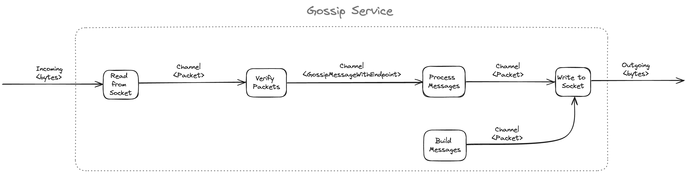
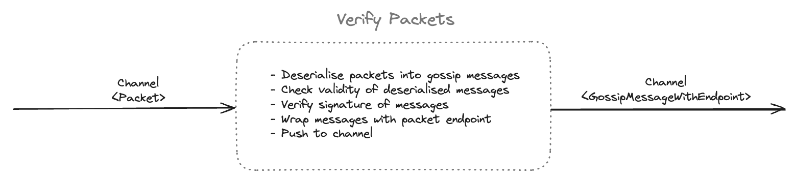
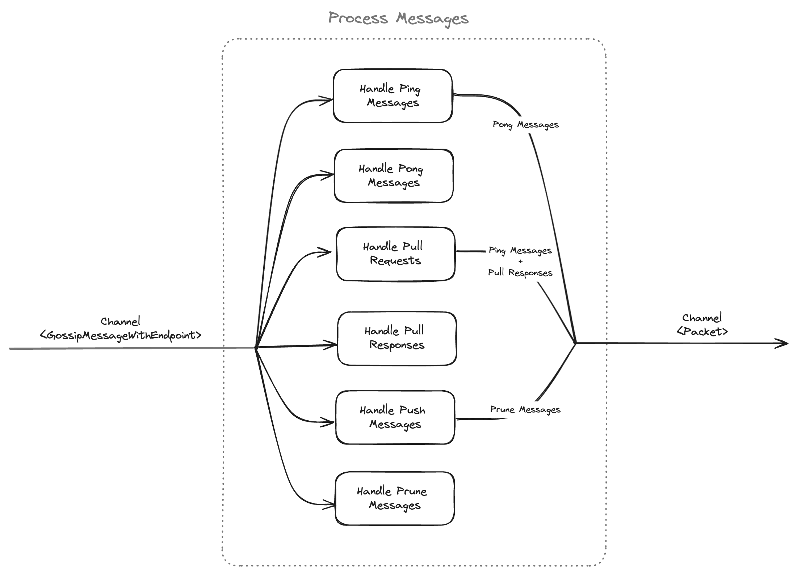
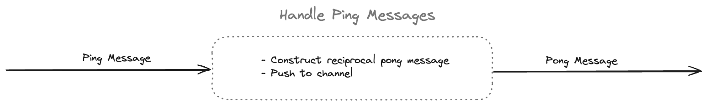
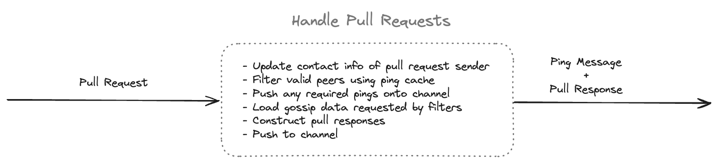
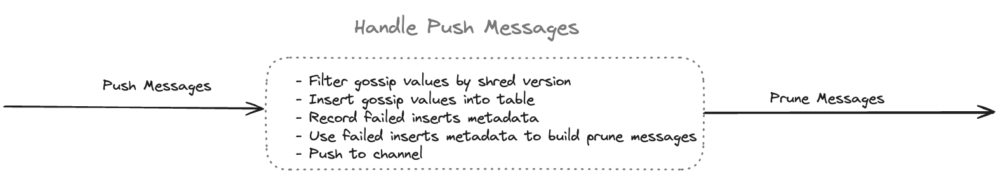
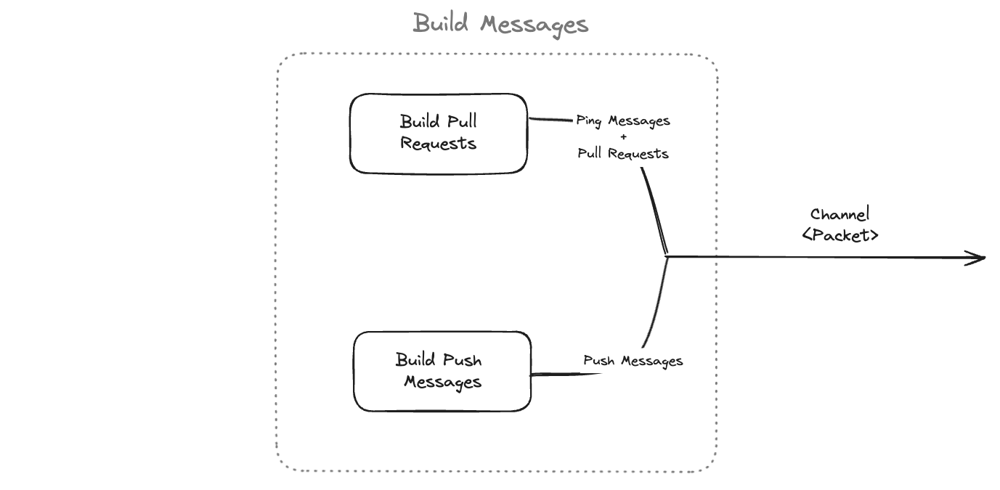
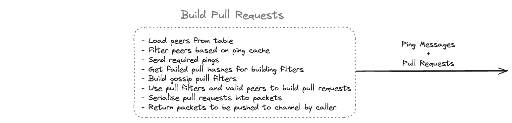

# Solana's Gossip Specification

This post will describe how Solana's gossip protocol works in-depth, as well as implementation details of Sig's gossip.

For an introduction to Solana's gossip protocol, check out the technical sections of our [Sig announcement blog post](https://blog.syndica.io/introducing-sig-by-syndica-an-rps-focused-solana-validator-client-written-in-zig/).

Checkout the full associated blog post here: [https://blog.syndica.io/sig-engineering-1-gossip-protocol/](https://blog.syndica.io/sig-engineering-1-gossip-protocol/).

## Repository File Outline 

- `service.zig`: main logic for reading, processing, and sending gossip messages
- `table.zig`: where gossip data is stored 
- `data.zig`: various gossip data structure definitions 
- `pull_request.zig`: logic for sending pull *requests* 
- `pull_response.zig`: logic for sending pull *responses* (/handling incoming pull requests)
- `gossip_shards.zig`: datastructure which stores gossip data hashes for quick lookup - used in `gossip_table` and constructing pull responses
- `active_set.zig`: logic for deriving a list of peers to send push messages to
- `ping_pong.zig`: logic for sending ping/pong messages as a heartbeat check

A gossip spy is, in essence, software written to do two things: store data and send/receive requests.

## Benchmarks 

benchmarks are located at the bottom of `service.zig`.

to run the benchmarks: 
- build sig in `ReleaseSafe` (ie, `zig build -Doptimize=ReleaseSafe`)
- run `./zig-out/bin/benchmark gossip`

this includes processing times for pings, push messages, pull responses, and 
pull requests.

## Fuzzing

the fuzzing client is located in `fuzz.zig`. 

to run the client
- start a sig gossip in a terminal (ie, listening on `8001`)
- build the fuzz client in `ReleaseSafe` (ie, `zig build -Doptimize=ReleaseSafe`)
- run the fuzz client pointing to sig with some seed and some number of random messages 
to send: `./zig-out/bin/fuzz <entrypoint> <seed> <num_messages>` (eg, `./zig-out/bin/fuzz 127.0.0.1:8001 19 100000`)

## Architecture

### Gossip Service 

The gossip service runs three main threads:

- verify packet
- process messages
- build messages

and two auxillary threads for reading and writing to the gossip socket.

### Verify Messages
The verify messages thread verifies all incoming packets and forwards valid gossip messages to the process messages thread.

### Process Messages 
The process messages thread handles all verified incoming gossip messages.

Handle Ping Messages

 

Handle Pong Messages

 

Handle Pull Requests

 

Handle Pull Responses

 

Handle Push Messages

 

Handle Prune Messages

 

### Build Messages
The build messages thread uses the internal gossip service state to achieve two primary objectives:
- build pull requests to obtain missing data from peers
- build push messages to inform peers of our current state

Build Pull Requests

 

Build Push Messages

 

