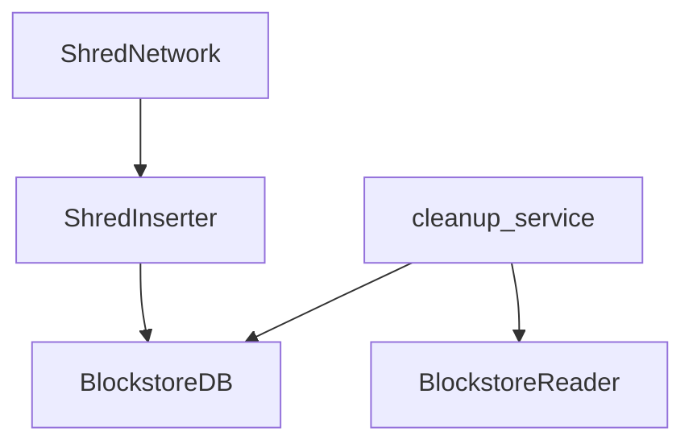

# Ledger

The ledger is a database which stores all block-related data (also referred to as the Blockstore).

The main code is located in `/src/ledger/`.

The ledger stores various types of block related data, with one of the most crucial being Shreds.

All data types stored by the ledger are defined in [`schema.zig`](./schema.zig).

## Architecture

Sig's ledger has a pluggable architecture, allowing for a swappable database backend.

Currently, two database backends are implemented:

1. **RocksDB**: Implementation found in [`rocksdb.zig`](./rocksdb.zig)
2. **HashMap**: Implementation found in [`hashmap_db.zig`](./hashmap_db.zig)

The interface that defines the structure of a database backend can be found in [`database.zig`](./database.zig).

Both the RocksDB and HashMap implementations satisfy this interface.

A utility function, `assertIsDatabase`, defined in [`database.zig`](./database.zig) is used to verify that any implementation adheres to the interface.

RocksDB has the concept of column families, a mechanism for logically partitioning the database.

You can read more about column families [here](https://github.com/facebook/rocksdb/wiki/column-families).

The column families defined for the ledger can be found in [`schema.zig`](./schema.zig), and they are used by both the RocksDB and HashMap implementations.

The database also supports transactions through a `WriteBatch`, ensuring that a group of operations are either all executed successfully or none are executed.

Note: The repository [rocksdb-zig](https://github.com/Syndica/rocksdb-zig) builds
the RocksDB project and makes it usable within Sig via RocksDB's C API and auto-generated Zig bindings.

## Source Layout

The core implementation of the ledger can be found in the [`ledger`](./) module.

## ShredNetwork, ShredInserter, and Shredder

### Shreds

As mentioned, Shreds are one of the most crucial data types stored in the ledger. To fully understand the ledger's implementation, a solid understanding of Shreds is required.

Shreds are fragments of blocks that enable transactions to be streamed within the Solana network. By allowing blocks to be sent as Shreds, there’s no need to wait for a complete block.

Shred transmission uses erasure coding to detect and correct errors, hence there are two types of Shreds:

- **Data Shreds**: Contain the actual block data.
- **Code Shreds**: Contain redundant information necessary to reconstruct Data Shreds.

The erasure coding algorithm used is [Reed-Solomon](https://en.wikipedia.org/wiki/Reed%E2%80%93Solomon_error_correction), a block-based error-correcting algorithm. The implementation can be found in [`reed_solomon.zig`](./reed_solomon.zig) and [`reed_solomon_table.zig`](./reed_solomon_table.zig).

For more information on Shreds, see the spec [here](https://github.com/solana-foundation/specs/blob/main/p2p/shred.md).

### Shred Network

The Shred Network is responsible for gathering and storing shreds from the network. While it is not a direct
part of the ledger, the ledger plays a crucial role in supporting its operations. As such, the Shred Network
is implemented in its own module, ie: [`shred_network`](../shred_network), separate from the ledger module.

A core part of the Shred Network is the `ShredNetwork` which collects shreds received via the Shred Network
and persist in ledger.

Understanding how the ShredNetwork interacts with components from the ledger can help sheds light on key elements of the
ledger’s architecture.

The following diagram illustrates the dependencies between the ShredNetwork and related components of the ledger:




- The **ShredNetwork** utilizes:
  - The **ShredInserter** to insert shreds received from the network via Gossip.

- The **ShredInserter** relies on:
  - The **BlockstoreDB**, which serves as the destination for writing data, backed by the RocksDB implementation of the ledger.

- The **cleanup service** employs:
  - The **BlockstoreDB** for performing cleanup operations, also backed by RocksDB.
  - The **BlockstoreReader** for reading data during cleanup.

The ShredNetwork can be run standalone without running the full node.

```
zig-out/bin/sig shred-network --leader-schedule <path_to_leader_schedule> --network <network> --test-repair-for-slot <slot>
```

Note: Running standalone requires manually needing to set to slot to repeatedly send repair requests for shreds from, via the `test-repair-for-slot` flag and
provide the leader schedule which is normally derived from the AccountDB if the full node is ran.

Note: The leader schedule can be retrieved via the `getLeaderShedule` RPC call and is expected
to be in the format generated from calling `./target/debug/solana leader-schedule --url <rpc-endpoint>` in Agave, ie:

```
slot pubkey
slot pubkey
slot pubkey
```

### ShredInserter

The **ShredInserter** is a component of the ledger used to insert shreds.

It is implemented in [`insert_shred.zig`](./insert_shred.zig). The main function that performs shred insertion and updates the corresponding metadata is `insertShreds`.

The `insertShreds` function validates the shreds, recovers any lost shreds, and saves them.

Note: The `insertShreds` function is adequately documented, so those details won't be repeated here.

### Shredder

The **Shredder** is a component of the ledger that can be used to reconstruct the original buffer from all shreds.

For example, it is used to recreate the Entries, as seen in the `getSlotEntriesInBlock` function in [`reader.zig`](./reader.zig).

## Reader and Writer

The **Reader** and **Writer** serve as wrappers around the ledger's backing database, providing a simplified interface for reading and writing data.

This abstraction allows interaction with the database without the need to directly engage with the underlying storage API.

It also facilitates the handling of domain-specific data, enabling operations beyond the standard data structures defined by the column families.

For example, the cleanup service utilizes the `reader.lowestSlot()` method to determine the slot up to which data should be cleaned in the ledger.

The **Reader** is implemented in [`reader.zig`](./reader.zig), while the **Writer** is implemented in [`writer.zig`](./writer.zig).

The tests in these two files are also a good resource for gaining a better understanding of the API exposed by the Reader and Writer.

## Putting It Together

The different components of the ledger—Backing Database, ShredInserter, Shredder, Reader, Writer, etc.—work together to manage how data is stored and retrieved.

The **BlockstoreDB** acts as the ledger’s storage, while the Reader and Writer simplify interactions with the database, making it easy to store and retrieve data without worrying about the low-level details of the storage backend.
