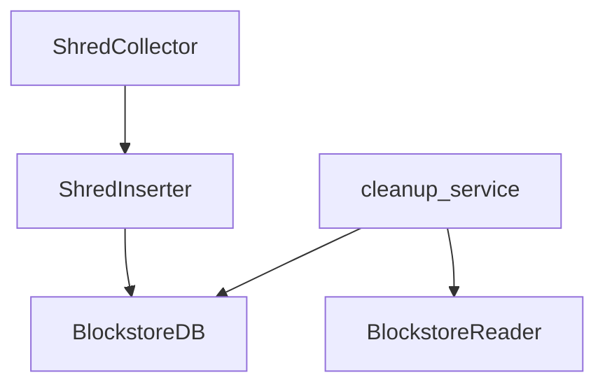
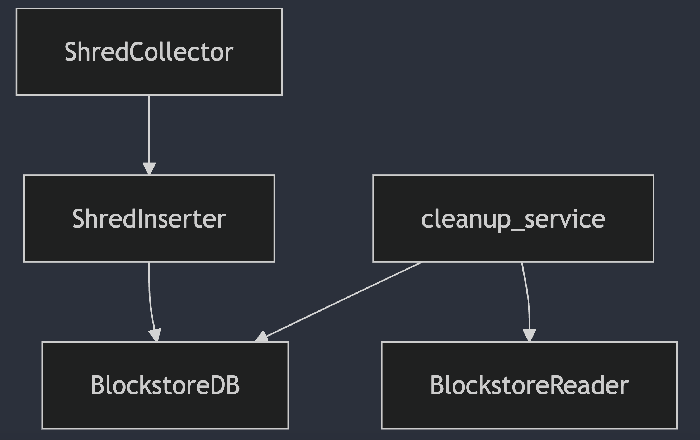

## Ledger Documentation

The ledger is a datastore component of Sig. Not to be confused with the AccountDB, which stores the current state of accounts, the ledger, on the other hand, stores all block-related data, which is why it is also referred to as the Blockstore.

The ledger stores various block data, with one of the most crucial types being Shreds. All types of data stored by the ledger can be seen in [`schema.zig`](./schema.zig).

## Architecture

Sig's ledger has a pluggable architecture, allowing for a swappable database backend.

Currently, two database backends are implemented:

1. RocksDB: Implementation found in [`rocksdb.zig`](./schema.zig)
2. HashMap: Implementation found in [`hashmap_db.zig`](./hashmap_db.zig)

The interface that defines the structure of a database backend can be found in [`database.zig`](./database.zig).

Both the RocksDB and HashMap implementations satisfy this interface. A utility function, `assertIsDatabase`, is used to check that any implementation adheres to the interface.

RocksDB introduces the concept of column families, a mechanism for logically partitioning the database. You can read more about column families [here](https://github.com/facebook/rocksdb/wiki/column-families).

The column families defined for the ledger can be found in [`schema.zig`](./schema.zig), and they are used by both the RocksDB and HashMap implementations.

Note that the database also supports transactions through a `WriteBatch`, which ensures that a group of operations are either all executed successfully or none are executed.

## Source Layout

The core implementation of the ledger can be found in the `ledger` module.

The repository [rocksdb-zig](https://github.com/Syndica/rocksdb-zig) builds the RocksDB project and makes it usable within Sig via RocksDB's C API and auto-generated Zig bindings.

<!-- Expand more and give an overview of Shreds -->

## Shred Collector, ShredInserter, and Shredder

### Shreds
As mentioned, the Shred is one of the most crucial data types stored in the ledger. To fully understand the ledger's implementation, a solid understanding of Shreds is required.

Shreds are fragments of blocks. They enable transactions to be streamed within the Solana network by allowing them to be sent as shreds without waiting for a complete block.

Shred transmission uses erasure coding to help detect and correct errors. Thus, there are two types of Shreds:

- Data Shreds: Contain the actual block data.
- Code Shreds: Contain redundant information necessary to reconstruct data shreds.

The erasure coding algorithm used is [Reed-Solomon-Code](https://en.wikipedia.org/wiki/Reed%E2%80%93Solomon_error_correction), a block-based error-correcting algorithm. The implementation can be found in [`./reed_solomon.zig`](./reed_solomon.zig) and [`./reed_solomon_table.zig`](./reed_solomon_table.zig).

For more information on Shreds, see the spec [here](https://github.com/solana-foundation/specs/blob/main/p2p/shred.md).

### Shred Collector

The Shred Collector is responsible for gathering and storing shreds from the network. While it is not a direct 
part of the ledger, the ledger plays a crucial role in supporting its operations. As such, the Shred Collector 
is implemented in its own module, ie: [`shred_collector`](../shred_collector), separate from the ledger module.

Understanding how the Shred Collector interacts with other components sheds light on key elements of the 
ledger’s architecture. 

The following diagram illustrates the dependencies between the Shred Collector and related components of the ledger:

- The **Shred Collector** utilizes:
  - The **ShredInserter** to insert shreds received from the network via Gossip.

- The **ShredInserter** relies on:
  - The **BlockstoreDB**, which serves as the destination for writing data, backed by the RocksDB implementation of the ledger.

- The **cleanup service** employs:
  - The **BlockstoreDB** for performing cleanup operations, also backed by RocksDB.
  - The **BlockstoreReader** for reading data during cleanup.

  
<!-- TODO Add information on how to start the shred collector -->

### ShredInserter

### Shredder

## Writer and Reader

<!-- Expand more on the writer and reader -->

<!-- ## Transaction Status ?? Dive deep into this and see what can be explained here -->

## Putting it Together

<!-- 

Provide an overview of how data flows into and out of the ledger during the normal operation of Sig, possibly touching on other components like gossip, turbine, etc., and how they interface with the ledger. 

-->