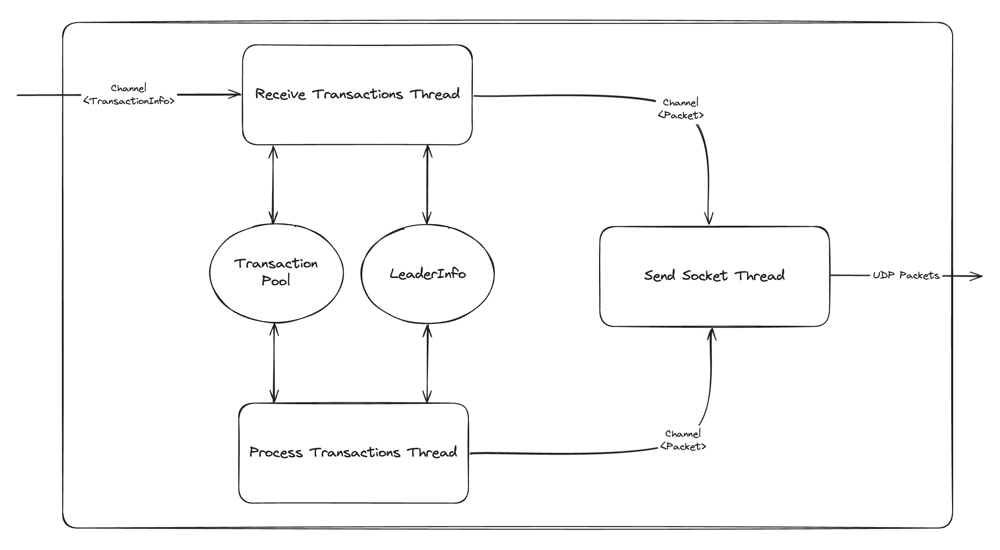

# Transaction Sender

- The transaction sender module implements the forwarding of transactions to leader validators in sig.
- The transaction sender receives transaction information from a channel, sends the transactions to the leader TPU addresses and then adds the transactions to a pool where they are retried until they are either expired, failed, or rooted. 

## Receive Transactions Thread (service.zig)
1. Receives new transactions from channel
3. Loads current leader tpu addresses using LeaderInfo
3. Performs initial send of new transactions
4. Adds new transactions to the pool

## Process Transactions Thread (service.zig)
1. Fetches pending transaction statuses via rpc call to **getSignatureStatuses**
2. Removes successful, failed and expired transactions from the pool
3. Loads current leader tpu addresses using LeaderInfo
4. Retries transactions which are still valid but not rooted

## TransactionInfo (transaction_info.zig)
- Wrapper around a serialised transaction which includes additional metadata required to send and retry the transaction 
    - `retries`: number of times the transaction as been retried
    - `max_retries`: maximum number of times the transaction can be retried
    - `last_sent_time`: last time the transaction was sent
    - `last_valid_blockheight`: last block before the transaction will be considered expired
    - `durable_nonce_info`: TODO

## TransactionPool (transaction_pool.zig)
- Provides thread safe mechanism for keeping track of pending transactions
- Provides means to efficiently keep track of which transactions should be retried and dropped

## LeaderInfo (leader_info.zig)
- Used to obtain the tpu addresses of the next `n` leaders (`Config.max_leaders_to_send_to`)
- Keeps a cache of leader tpu addresses
- Uses gossip table to populate cache for all leaders in the leader schedule
- Keeps track of the current epoch info and leader schedule via rpc calls to **getEpochInfo** and **getLeaderSchedule**
- Provides one public method `getLeaderAddresses`:
    1. Gets the current slot via rpc call to **getSlot**
    2. Check that the slot is within the current epoch and leader schedule, otherwise update epoch info and leader schedule
    3. For each of the next `n` leaders in the leader schedule, attempt to load their tpu address from the cache
    4. If the number of leaders which had cached addresses is less than floor(n/2), then perform a cache update 
    5. Return leader addresses

## Mock Transfer Generator (mock_transfer_generator.zig)
- Temporary testing service used to confirm that transactions land on chain successfully
- Sends small transfer instructions between two tesnet accounts to a channel
